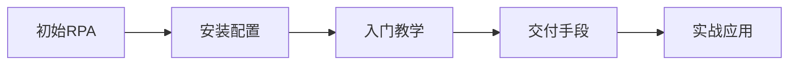

# 提效进阶

---

## 一、章节概述

### 本章简介

恭喜你完成了AI基础入门！现在你已经掌握了与AI高效沟通的核心方法。

本章将带你进入**零代码自动化**的世界。RPA（机器人流程自动化）是一项让你能够"教会电脑帮你干活"的技术。不需要编程基础，只需要学会"拖拖拽拽"，就能让电脑自动完成那些让你头疼的重复性工作。

### 学习目标

完成本章学习后，你将获得：

- **认知目标**: 理解RPA是什么、能做什么、适合什么场景
- **技能目标**: 掌握至少一款RPA工具的安装和基本操作
- **应用目标**: 能够独立搭建简单的自动化流程，解放重复性劳动

---

## 二、核心内容模块

本章包含四个核心模块，循序渐进地帮助你掌握RPA自动化能力：

### 模块一：初始RPA

**📄 [查看详情](02_01_初始RPA.md)**

- 什么是RPA——用通俗语言理解机器人流程自动化
- RPA优劣势分析——电脑连点器、解放双手执行批量化工作
- 市面上常见RPA工具介绍：影刀、八爪鱼、Power Automate等

> 学完这个模块，你将对RPA有清晰的认识，知道它能为你的工作带来什么改变。

### 模块二：如何安装一个RPA

**📄 [查看详情](02_02_RPA安装指南.md)**

- RPA工具的选择建议
- 详细安装步骤图文教程
- 安装后的基础配置
- 常见安装问题排查

> 学完这个模块，你将成功安装并配置好一款RPA工具，为后续学习做好准备。

### 模块三：RPA入门教学

**📄 [查看详情](02_03_RPA入门教学.md)**

- RPA的基本操作解析
- 流程搭建的核心逻辑
- 常用组件和功能介绍
- 第一个自动化流程实战

> 学完这个模块，你将能够独立搭建简单的自动化流程，体验"教会电脑干活"的成就感。

### 模块四：RPA常用交付手段

**📄 [查看详情](02_04_RPA常用交付手段.md)**

- 直接数据交付——将结果输出为Excel、CSV等格式
- 应用内交付——直接在目标系统中操作
- 消息通知交付——通过邮件、企业微信等推送结果
- 交付方式选择指南

> 学完这个模块，你将掌握多种交付方式，让自动化结果能够便捷地服务于实际工作。

---

## 三、学习路径建议

### 学习顺序

1. **先理解概念**：从模块一开始，建立对RPA的正确认知
2. **动手安装**：选择一款适合自己的RPA工具并完成安装
3. **边学边练**：跟着入门教学搭建第一个自动化流程
4. **掌握交付**：学习如何将自动化结果应用到实际工作中

### 预期成果

完成本章学习后，你将能够：

| 场景 | 自动化前 | 自动化后 |
|------|---------|---------|
| 数据录入 | 每天手动复制粘贴2小时 | 自动完成，5分钟出结果 |
| 表格整理 | 手动调整格式、计算 | 一键生成规范表格 |
| 信息收集 | 逐个网站打开复制 | 自动抓取并汇总 |
| 定时任务 | 需要记得执行 | 定时自动运行 |

---

## 四、下一步

达成本章成果后，你将解锁下一章节：

**→ [03_流程闭环](../03_流程闭环/03_00_index.md)**

在下一章中，你将学习如何将多个自动化任务串联成完整的工作流程，实现更高效的业务闭环。

---

## 附录

### 常用RPA工具对比

| 工具名称 | 特点 | 适用场景 | 价格 |
|---------|------|---------|------|
| 影刀 | 国产、中文友好、社区活跃 | 电商运营、数据采集 | 免费版+付费版 |
| 八爪鱼 | 可视化采集、模板丰富 | 网页数据抓取 | 免费版+付费版 |
| Power Automate | 微软生态、企业级 | Office用户、企业流程 | 订阅制 |
| UiPath | 功能强大、企业首选 | 复杂企业流程 | 企业定价 |

### 推荐资源

- [常用工具指南](../常用工具/index.md)
- [常见名词解释](../常见名词解释.md)

### 术语表

本章涉及的基础术语：

- **RPA（机器人流程自动化）**: 使用软件机器人模拟人类操作，自动执行重复性任务的技术
- **流程（Flow）**: 一系列有序的操作步骤，组成一个完整的自动化任务
- **组件（Component）**: RPA工具中预设的功能模块，如"点击"、"输入"、"循环"等
- **触发器（Trigger）**: 启动自动化流程的条件，如定时触发、手动触发、事件触发

---

*本章是AI Navigator进阶路径的第二步。RPA是零代码自动化的起点，掌握它，你将开启效率提升的新篇章！*
