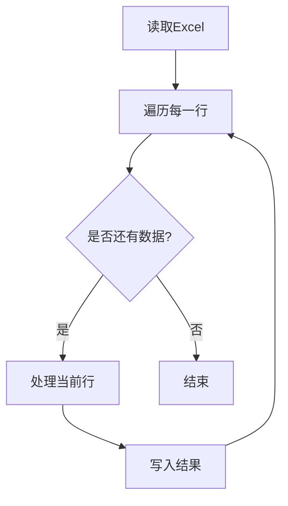
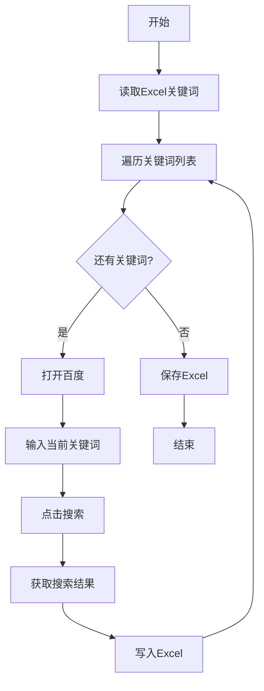

# RPA入门教学

> **模块目标**: 掌握RPA的核心组件和基本操作，能够独立搭建简单的自动化流程

---

## 一、RPA操作的核心逻辑

### 1.1 理解自动化流程的本质

在开始学习具体操作之前，我们需要理解RPA的核心逻辑：

> **自动化流程 = 一系列有序的操作步骤**

就像你在教一个新员工做事一样：

```
你告诉新员工：
1. 打开Excel文件
2. 找到A列的数据
3. 复制到网页表单
4. 点击提交

你告诉RPA：
完全一样的步骤！
```

### 1.2 RPA流程的三要素

任何RPA流程都包含三个核心要素：

| 要素 | 说明 | 示例 |
|-----|------|------|
| **触发器** | 什么时候开始 | 定时触发、手动触发、事件触发 |
| **操作步骤** | 具体做什么 | 点击、输入、复制、循环 |
| **输出结果** | 得到什么 | 数据保存、消息通知、文件生成 |

### 1.3 RPA开发的两种方式

#### 方式一：录制模式

```
优点：简单直观，像录视频一样
缺点：不够灵活，容易受界面变化影响
适合：简单、固定的操作流程
```

#### 方式二：拖拽组件

```
优点：灵活可控，易于维护
缺点：需要学习成本
适合：复杂、需要逻辑判断的流程
```

> 💡 **建议**: 新手先从录制模式入门，逐步过渡到拖拽组件方式

---

## 二、常用组件介绍

### 2.1 基础操作类组件

#### 鼠标操作

| 组件名称 | 功能 | 常用场景 |
|---------|------|---------|
| **点击元素** | 模拟鼠标点击 | 点击按钮、链接 |
| **双击元素** | 模拟双击 | 打开文件、文件夹 |
| **右键点击** | 模拟右键 | 打开右键菜单 |
| **鼠标移动** | 移动到指定位置 | 悬停操作 |
| **拖拽** | 拖动元素 | 移动文件、选择文本 |

#### 键盘操作

| 组件名称 | 功能 | 常用场景 |
|---------|------|---------|
| **输入文本** | 在输入框中输入内容 | 填写表单 |
| **按键** | 模拟按键操作 | 回车、Tab、快捷键 |
| **快捷键** | 执行组合键 | Ctrl+C复制、Ctrl+V粘贴 |

#### 示例：自动登录网站


### 2.2 数据处理类组件

#### 数据读取

| 组件名称 | 功能 | 常用场景 |
|---------|------|---------|
| **读取Excel** | 读取Excel文件数据 | 获取待处理数据 |
| **读取CSV** | 读取CSV文件 | 数据导入 |
| **读取网页** | 抓取网页内容 | 数据采集 |
| **读取剪贴板** | 获取剪贴板内容 | 数据传递 |

#### 数据写入

| 组件名称 | 功能 | 常用场景 |
|---------|------|---------|
| **写入Excel** | 写入数据到Excel | 结果保存 |
| **写入CSV** | 写入数据到CSV | 数据导出 |
| **写入剪贴板** | 设置剪贴板内容 | 数据传递 |

### 2.3 逻辑控制类组件

#### 条件判断

```
如果 [条件成立]
    执行操作A
否则
    执行操作B
```

**示例场景**：
- 如果Excel单元格不为空，则复制内容
- 如果网页包含"登录成功"，则继续操作

#### 循环操作

| 循环类型 | 说明 | 示例场景 |
|---------|------|---------|
| **For循环** | 指定次数循环 | 处理前10条数据 |
| **For Each** | 遍历列表 | 处理Excel每一行 |
| **While循环** | 条件循环 | 重复直到成功 |

#### 示例：批量处理Excel数据



### 2.4 等待与延时

| 组件名称 | 功能 | 使用场景 |
|---------|------|---------|
| **等待元素出现** | 等待页面元素加载 | 网页操作 |
| **等待元素消失** | 等待加载完成 | 等待弹窗消失 |
| **固定延时** | 等待指定时间 | 网络延迟补偿 |

> ⚠️ **注意**: 尽量使用"等待元素"而非"固定延时"，前者更稳定可靠

---

## 三、第一个自动化流程实战

### 3.1 实战目标

**任务**：自动打开百度搜索，输入关键词并搜索

这是一个最简单的入门案例，帮助你熟悉RPA的基本操作流程。

### 3.2 步骤详解

#### 步骤1：创建新流程

1. 打开影刀RPA客户端
2. 点击"新建流程"
3. 输入流程名称：`百度搜索测试`
4. 选择"空白流程"
5. 点击"确定"

#### 步骤2：添加"打开网页"组件

1. 在左侧组件库找到"网页操作"
2. 拖拽"打开网页"组件到编辑区
3. 配置参数：
   - 网址：`https://www.baidu.com`
   - 浏览器：Chrome

#### 步骤3：添加"输入文本"组件

1. 拖拽"输入文本"组件
2. 点击"选择元素"按钮
3. 在百度页面点击搜索框
4. 输入文本：`RPA自动化`

#### 步骤4：添加"点击元素"组件

1. 拖拽"点击元素"组件
2. 点击"选择元素"按钮
3. 在百度页面点击"百度一下"按钮

#### 步骤5：保存并运行

1. 点击"保存"按钮
2. 点击"运行"按钮
3. 观察自动化执行过程

### 3.3 流程结构图

```
┌─────────────────────────────────────┐
│            百度搜索测试              │
├─────────────────────────────────────┤
│  1. 打开网页                         │
│     └─ 网址: https://www.baidu.com  │
├─────────────────────────────────────┤
│  2. 输入文本                         │
│     └─ 目标: 搜索框                  │
│     └─ 内容: RPA自动化               │
├─────────────────────────────────────┤
│  3. 点击元素                         │
│     └─ 目标: 百度一下按钮            │
└─────────────────────────────────────┘
```

---

## 四、进阶实战：Excel数据自动化

### 4.1 实战目标

**任务**：读取Excel中的关键词列表，逐个在百度搜索并保存搜索结果标题

### 4.2 准备工作

创建一个Excel文件 `keywords.xlsx`：

| 关键词 |
|-------|
| RPA |
| AI |
| 自动化 |

### 4.3 步骤详解

#### 步骤1：读取Excel数据

1. 拖拽"读取Excel"组件
2. 配置参数：
   - 文件路径：选择 `keywords.xlsx`
   - 读取方式：读取所有数据
   - 输出变量：`keywordList`

#### 步骤2：添加循环

1. 拖拽"For Each"循环组件
2. 配置参数：
   - 遍历对象：`keywordList`
   - 当前项变量：`currentKeyword`

#### 步骤3：在循环内添加操作

在循环体内添加以下组件：

1. **打开网页** → 百度首页
2. **输入文本** → 搜索框，内容为 `currentKeyword`
3. **点击元素** → 百度一下按钮
4. **等待元素** → 等待搜索结果加载
5. **获取文本** → 获取第一个搜索结果标题
6. **写入Excel** → 将结果写入新列

### 4.4 完整流程图



---

## 五、调试与优化技巧

### 5.1 调试方法

#### 单步调试

1. 点击"调试"按钮
2. 流程会逐步执行
3. 观察每一步的执行结果
4. 定位问题所在

#### 断点设置

1. 在组件上右键
2. 选择"设置断点"
3. 运行时会在断点处暂停
4. 方便检查中间状态

#### 日志输出

在关键步骤添加"日志输出"组件：

```
日志内容：当前处理到第X条数据，关键词为XXX
```

### 5.2 常见问题与解决

#### 问题1：元素找不到

**原因**：页面加载慢，元素还未出现

**解决**：
- 添加"等待元素出现"组件
- 增加等待时间

#### 问题2：操作不稳定

**原因**：网络波动、页面响应慢

**解决**：
- 在关键步骤间添加适当延时
- 使用"重试"机制

#### 问题3：数据格式错误

**原因**：数据类型不匹配

**解决**：
- 添加数据格式转换
- 使用条件判断过滤异常数据

### 5.3 优化建议

| 优化方向 | 具体方法 |
|---------|---------|
| **稳定性** | 添加等待、重试机制 |
| **可读性** | 合理命名、添加注释 |
| **可维护性** | 模块化、使用变量 |
| **效率** | 减少不必要的操作、并行处理 |

---

## 六、最佳实践

### 6.1 流程设计原则

1. **单一职责**：一个流程只做一件事
2. **模块化**：复杂流程拆分为多个子流程
3. **异常处理**：考虑各种异常情况
4. **可配置**：将变化的部分设为变量

### 6.2 命名规范

| 类型 | 命名规范 | 示例 |
|-----|---------|------|
| 流程名称 | 动词+名词 | 批量搜索关键词 |
| 变量名称 | 有意义的英文 | keywordList |
| 组件注释 | 简洁说明 | 读取关键词Excel |

### 6.3 版本管理

1. 定期备份流程文件
2. 重大修改前另存新版本
3. 记录修改日志

---

## 七、本章小结

### 核心要点回顾

1. **核心逻辑**：自动化流程= 触发器 + 操作步骤 + 输出结果
2. **常用组件**：鼠标操作、键盘操作、数据处理、逻辑控制
3. **开发方式**：录制模式和拖拽组件模式
4. **调试技巧**：单步调试、断点、日志输出
5. **最佳实践**：单一职责、模块化、异常处理

### 自检清单

完成本章学习后，确认：

- [ ] 我理解RPA流程的核心逻辑
- [ ] 我熟悉常用的组件类型
- [ ] 我能够独立搭建简单的自动化流程
- [ ] 我知道如何调试和优化流程
- [ ] 我已经完成了实战练习

### 下一步

掌握RPA基本操作后，你已具备搭建自动化流程的能力：

**→ [RPA常用交付手段](02_04_RPA常用交付手段.md)**

在下一模块中，你将学习如何将自动化结果以多种方式交付，让自动化真正服务于实际工作。

---

*实践出真知。动手搭建你的第一个自动化流程吧！*
