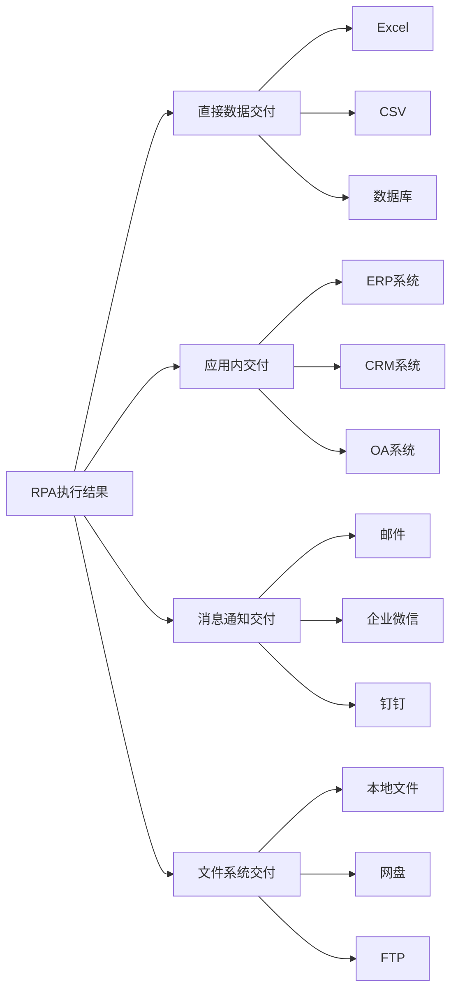

# RPA常用交付手段

> **模块目标**: 掌握直接数据交付、应用内交付、消息通知交付等多种方式，选择最适合场景的交付手段

---

## 一、为什么交付方式很重要

### 1.1 交付的意义

RPA执行完成后，结果需要以某种方式"交付"给使用者或下游系统。选择合适的交付方式，能够：

- ✅ 让自动化结果真正可用
- ✅ 减少人工干预环节
- ✅ 提升整体流程效率
- ✅ 实现流程闭环

### 1.2 交付方式概览



---

## 二、直接数据交付

### 2.1 Excel交付

Excel是最常用的数据交付方式，适合大多数办公场景。

#### 适用场景

- 数据报表生成
- 批量数据整理
- 定期数据汇总

#### 实现方式

**方式一：写入现有Excel**

```
步骤：
1. 打开现有Excel文件
2. 定位到目标工作表
3. 写入数据到指定单元格
4. 保存文件
```

**方式二：创建新Excel**

```
步骤：
1. 创建新的Excel对象
2. 设置表头
3. 逐行写入数据
4. 设置格式（可选）
5. 保存到指定路径
```

#### 格式化技巧

| 技巧 | 说明 | 效果 |
|-----|------|------|
| **设置表头样式** | 加粗、背景色 | 提升可读性 |
| **自动列宽** | 根据内容调整 | 显示完整 |
| **条件格式** | 数据高亮 | 突出重点 |
| **数据透视表** | 自动汇总 | 快速分析 |

#### 示例：生成销售日报

```
输入：当日销售数据
处理：
1. 创建新Excel
2. 写入表头：日期、产品、销量、金额
3. 逐行写入销售记录
4. 添加汇总行
5. 设置金额列格式为货币
6. 保存为：销售日报_20240115.xlsx
输出：格式化的Excel文件
```

### 2.2 CSV交付

CSV是轻量级的数据格式，适合数据交换和系统对接。

#### 适用场景

- 系统间数据导入导出
- 大数据量处理
- 跨平台数据交换

#### 优缺点对比

| 优点 | 缺点 |
|-----|------|
| 文件体积小 | 不支持格式 |
| 读写速度快 | 不支持多工作表 |
| 兼容性好 | 不支持公式 |
| 易于程序处理 | 中文可能乱码 |

#### 注意事项

1. **编码问题**：建议使用UTF-8编码
2. **分隔符**：逗号或制表符
3. **特殊字符**：注意引号转义

### 2.3 数据库交付

直接写入数据库，适合需要持久化存储或供其他系统调用的场景。

#### 适用场景

- 数据需要长期存储
- 多系统共享数据
- 需要复杂查询

#### 常见数据库支持

| 数据库 | 说明 |
|-------|------|
| MySQL | 开源关系型数据库 |
| SQL Server | 微软企业级数据库 |
| Oracle | 大型企业数据库 |
| MongoDB | NoSQL文档数据库 |

#### 基本操作

```
1. 建立数据库连接
2. 构建SQL语句
3. 执行插入/更新操作
4. 关闭连接
```

---

## 三、应用内交付

### 3.1 什么是应用内交付

应用内交付是指RPA直接在目标系统中操作，将数据"写入"而非"导出"。

```
直接数据交付：RPA → 导出文件 → 人工导入系统
应用内交付：RPA → 直接操作系统 → 数据已就位
```

### 3.2 常见应用场景

#### ERP系统录入

| 场景 | 操作流程 |
|-----|---------|
| 采购订单录入 | 读取Excel订单 → 登录ERP → 逐条录入 |
| 销售数据同步 | 获取销售数据 → 打开ERP → 更新记录 |
| 库存盘点录入 | 读取盘点表 → 进入库存模块 → 更新数量 |

#### CRM系统操作

| 场景 | 操作流程 |
|-----|---------|
| 客户信息录入 | 获取客户资料 → 打开CRM → 新建客户 |
| 跟进记录同步 | 读取沟通记录 → 更新客户动态 |
| 线索分配 | 获取线索列表 → 批量分配销售 |

#### OA系统流程

| 场景 | 操作流程 |
|-----|---------|
| 报销单提交 | 读取报销数据 → 登录OA → 填写表单 → 提交 |
| 请假申请 | 获取请假信息 → 打开请假流程 → 提交审批 |

### 3.3 应用内交付的注意事项

#### 优点

- ✅ 数据直接到位，无需人工转运
- ✅ 减少中间环节，降低出错风险
- ✅ 实时性强，数据即时可用

#### 挑战

- ⚠️ 系统界面变化会影响流程
- ⚠️ 需要系统登录权限
- ⚠️ 操作速度受系统响应影响

#### 最佳实践

1. **使用稳定的元素定位**：优先使用ID、Name等稳定属性
2. **添加等待机制**：确保页面加载完成再操作
3. **异常处理**：处理登录过期、网络超时等情况
4. **操作日志**：记录每次操作的结果

---

## 四、消息通知交付

### 4.1 邮件通知

邮件是最通用的通知方式，适合正式、需要留痕的场景。

#### 适用场景

- 定期报表发送
- 异常告警通知
- 任务完成提醒

#### 邮件内容要素

| 要素 | 说明 | 示例 |
|-----|------|------|
| **收件人** | 接收邮件的人 | manager@company.com |
| **主题** | 邮件标题 | 【日报】2024年1月15日销售数据 |
| **正文** | 邮件内容 | 各位好，附件是今日销售数据... |
| **附件** | 附加文件 | 销售日报.xlsx |
| **抄送** | 抄送人员 | team@company.com |

#### 示例配置

```
邮件组件配置：
- SMTP服务器：smtp.company.com
- 端口：465
- 发件人：rpa@company.com
- 收件人：manager@company.com
- 主题：【自动通知】数据采集完成
- 正文：
  尊敬的管理者：
  
  您好！数据采集任务已完成。
  
  采集时间：2024-01-15 18:00
  数据条数：1,234条
  结果文件：见附件
  
  此邮件由RPA自动发送，请勿回复。
- 附件：D:\RPA\Output\数据采集结果.xlsx
```

### 4.2 企业微信/钉钉通知

即时通讯工具适合快速、非正式的通知场景。

#### 企业微信机器人

**设置步骤**：

1. 在企业微信群中添加机器人
2. 获取Webhook地址
3. 在RPA中配置HTTP请求

**消息格式**：

```json
{
    "msgtype": "markdown",
    "markdown": {
        "content": "### 任务完成通知\n> 任务名称：数据采集\n> 执行时间：18:00\n> 结果：成功\n> 数据量：1,234条"
    }
}
```

#### 钉钉机器人

**设置步骤**：

1. 在钉钉群中添加自定义机器人
2. 安全设置选择"加签"或"自定义关键词"
3. 获取Webhook和密钥
4. 在RPA中配置

**消息类型**：

| 类型 | 说明 | 适用场景 |
|-----|------|---------|
| text | 纯文本 | 简单通知 |
| markdown | Markdown格式 | 富文本内容 |
| link | 链接卡片 | 跳转查看 |
| actionCard | 动作卡片 | 交互操作 |

### 4.3 短信通知

短信适合紧急、重要的通知场景。

#### 适用场景

- 紧急异常告警
- 验证码发送
- 重要提醒

#### 注意事项

- 短信有成本，谨慎使用
- 注意发送频率限制
- 内容需要简洁明了

---

## 五、文件系统交付

### 5.1 本地文件操作

#### 常用操作

| 操作 | 说明 | 示例场景 |
|-----|------|---------|
| **创建文件夹** | 新建目录 | 按日期归档 |
| **复制文件** | 复制到指定位置 | 备份文件 |
| **移动文件** | 移动到目标位置 | 归档处理 |
| **重命名文件** | 修改文件名 | 规范命名 |
| **删除文件** | 清理过期文件 | 定期清理 |

#### 文件命名规范

```
推荐格式：[类型]_[日期]_[序号].[扩展名]

示例：
报表_20240115_001.xlsx
数据采集_20240115.csv
日志_20240115.txt
```

### 5.2 网盘同步

将结果文件同步到云盘，方便团队协作。

#### 常见网盘

| 网盘 | 同步方式 |
|-----|---------|
| 百度网盘 | 客户端同步 |
| 阿里云盘 | 客户端同步 |
| OneDrive | 客户端同步 |
| 腾讯微云 | 客户端同步 |

#### 实现方式

1. 安装网盘客户端
2. 设置同步文件夹
3. RPA将输出文件保存到同步文件夹
4. 网盘自动同步

### 5.3 FTP/SFTP上传

适合需要上传到服务器的场景。

#### 配置要素

```
FTP配置：
- 服务器地址：ftp.company.com
- 端口：21
- 用户名：rpa_user
- 密码：******
- 远程目录：/data/input/
```

---

## 六、交付方式选择指南

### 6.1 场景匹配表

| 场景 | 推荐交付方式 | 原因 |
|-----|------------|------|
| 日报周报 | Excel + 邮件 | 格式规范、正式留痕 |
| 数据采集 | CSV + 网盘 | 轻量、易共享 |
| 系统录入 | 应用内交付 | 直接到位 |
| 异常告警 | 企业微信/钉钉 | 即时触达 |
| 紧急通知 | 短信 | 确保送达 |
| 团队协作 | 网盘同步 | 便于共享 |

### 6.2 组合使用

实际工作中，常常需要组合多种交付方式：

**示例：完整的数据采集任务**

```
1. 数据采集 → CSV文件（原始数据）
2. 数据处理 → Excel文件（格式化数据）
3. 系统录入 → 应用内交付（ERP系统）
4. 完成通知 → 企业微信（即时通知）
5. 正式汇报 → 邮件 + 附件（正式留痕）
```

### 6.3 交付检查清单

在设置交付方式时，检查以下要点：

- [ ] 输出路径是否正确
- [ ] 文件命名是否规范
- [ ] 收件人/接收方是否正确
- [ ] 通知内容是否完整
- [ ] 是否需要备份
- [ ] 异常情况如何处理

---

## 七、本章小结

### 核心要点回顾

1. **直接数据交付**：Excel、CSV、数据库，适合数据存储和交换
2. **应用内交付**：直接在目标系统操作，数据即时到位
3. **消息通知交付**：邮件、企业微信、钉钉、短信，及时触达相关人员
4. **文件系统交付**：本地文件、网盘、FTP，便于存储和共享
5. **选择原则**：根据场景需求，选择最合适的交付方式

### 自检清单

完成本章学习后，确认：

- [ ] 我了解各种交付方式的特点和适用场景
- [ ] 我能够配置Excel和CSV输出
- [ ] 我知道如何设置邮件和企业微信通知
- [ ] 我能够根据场景选择合适的交付方式
- [ ] 我理解组合使用多种交付方式的价值

### 下一步

完成本章学习后，你已经掌握了RPA的核心技能：

**→ [03_流程闭环](../03_流程闭环/03_00_index.md)**

在下一章中，你将学习如何将多个自动化任务串联成完整的工作流程，实现更高效的业务闭环。

---

*交付是自动化的最后一步，也是最关键的一步。选对交付方式，让自动化成果真正落地！*
