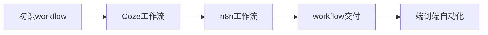
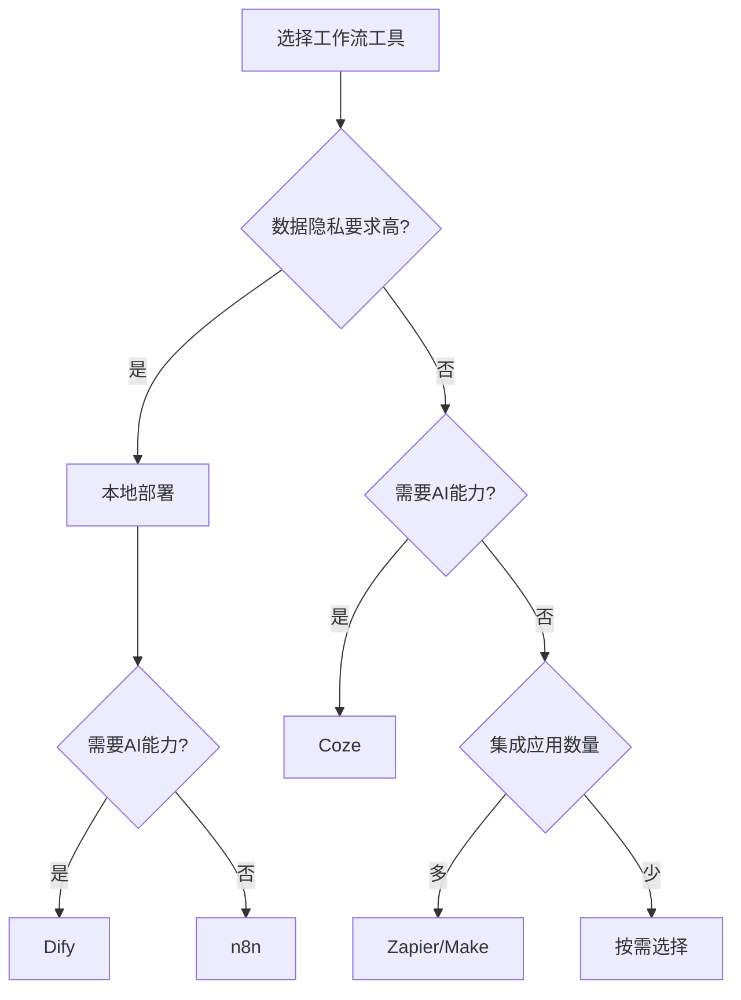

# 流程闭环

---

## 一、章节概述

### 本章简介

恭喜你完成了提效进阶！现在你已经掌握了RPA自动化技能，能够解放重复性劳动。

本章将带你进入**工作流编排**的世界。如果说RPA是"教会电脑帮你干活"，那么Workflow就是"让多个工具协同工作"。通过工作流，你可以将AI、RPA、数据处理、消息通知等能力串联起来，构建端到端的自动化闭环。

### 学习目标

完成本章学习后，你将获得：

- **认知目标**: 理解Workflow是什么、与RPA的异同、如何选择合适的工具
- **技能目标**: 掌握Coze和n8n两款工作流工具的基本操作
- **应用目标**: 能够独立搭建完整的工作流，实现从数据获取到结果输出的全链路自动化

---

## 二、核心内容模块

本章包含四个核心模块，循序渐进地帮助你掌握工作流编排能力：

### 模块一：初识workflow工作流

**📄 [查看详情](03_01_初识workflow工作流.md)**

- 什么是workflow——流程编排的艺术
- workflow与RPA的异同——优劣势对比
- 常用工作流工具介绍
  - 云上工具：Coze、Make、Zapier
  - 本地工具：n8n、Dify
- 云上vs本地：如何选择适合自己的workflow

> 学完这个模块，你将对Workflow有清晰的认识，知道如何选择适合自己的工作流工具。

### 模块二：快速上手Coze工作流

**📄 [查看详情](03_02_快速上手coze工作流.md)**

- Coze基本介绍——字节跳动AI Agent开发平台
- 节点类型详解——基础节点、逻辑节点、工具节点
- 插件玩法——内置插件与配置方法
- 添加一段代码——代码节点的使用
- 实战案例：构建智能问答工作流

> 学完这个模块，你将能够使用Coze搭建AI驱动的工作流，体验云端工作流的便捷。

### 模块三：快速上手n8n

**📄 [查看详情](03_03_快速上手n8n.md)**

- n8n本地部署——Docker部署详细步骤
- 插件玩法——节点体系与常用节点
- 功能拓展——自定义节点与系统集成
- 实战案例：自动化日报生成

> 学完这个模块，你将掌握n8n的使用方法，能够搭建本地化的自动化工作流。

### 模块四：workflow交付

**📄 [查看详情](03_04_workflow交付.md)**

- 交付概述——从开发到使用的最后一公里
- 常见交付方式——Bot/Agent、API、定时任务、消息通知
- 交付最佳实践——错误处理、日志监控、文档交接
- 实战：完整工作流交付

> 学完这个模块，你将掌握多种交付方式，让工作流真正服务于实际业务。

---

## 三、学习路径建议

### 学习顺序

1. **先理解概念**：从模块一开始，建立对Workflow的正确认知
2. **云端体验**：使用Coze快速体验AI工作流的魅力
3. **本地实践**：学习n8n，掌握本地化部署和系统集成
4. **交付上线**：学习如何将工作流交付给实际业务使用

### 预期成果

完成本章学习后，你将能够：

| 场景 | 自动化前 | 自动化后 |
|------|---------|---------|
| 信息收集+整理 | 手动打开多个网站、复制粘贴 | 工作流自动抓取、清洗、汇总 |
| AI内容生成 | 每次手动输入提示词 | 工作流自动调用AI、输出结果 |
| 日报/周报 | 手动统计数据、写报告 | 定时自动生成并推送 |
| 多系统协同 | 在多个系统间切换操作 | 工作流自动串联各系统 |

---

## 四、下一步

达成本章成果后，你将解锁下一章节：

**→ [04_壁垒构建](../04_壁垒构建/04_00_index.md)**

在下一章中，你将学习如何构建自己的竞争壁垒，让自动化能力成为你的核心竞争力。

---

## 附录

### 常用工作流工具对比

| 工具名称 | 类型 | 特点 | 适用场景 |
|---------|------|------|---------|
| Coze | 云上 | AI能力强、易上手 | AI Agent开发、智能问答 |
| Make | 云上 | 集成丰富、可视化 | SaaS工具串联、业务自动化 |
| Zapier | 云上 | 应用最多、操作简单 | 快速集成、轻量自动化 |
| n8n | 本地 | 开源免费、可定制 | 数据敏感场景、复杂集成 |
| Dify | 本地 | AI应用开发、可视化 | 企业AI应用、知识库问答 |

### 工具选择决策树

### 推荐资源

- [常用工具指南](../常用工具/index.md)
- [常见名词解释](../常见名词解释.md)

### 术语表

本章涉及的基础术语：

- **Workflow（工作流）**: 将多个任务按逻辑顺序串联，实现端到端自动化
- **节点（Node）**: 工作流中执行具体任务的单元
- **触发器（Trigger）**: 启动工作流执行的条件或事件
- **API（应用程序接口）**: 不同软件系统之间通信的桥梁
- **Webhook**: 一种实时数据推送机制，当事件发生时自动触发通知

---

*本章是AI Navigator进阶路径的第三步。掌握工作流编排，你将实现从"单点自动化"到"全链路闭环"的跨越！*
