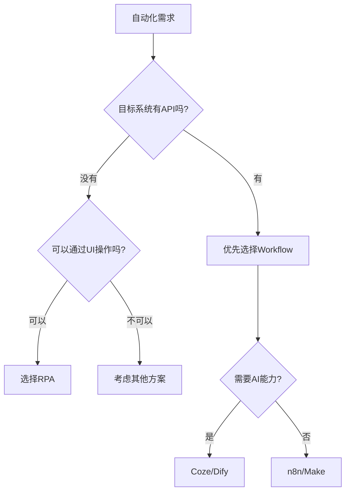

# 初识workflow工作流

> **模块目标**: 消除对Workflow的陌生感，建立正确的工作流认知，选择适合自己的工作流工具

---

## 一、什么是workflow工作流

### 1.1 workflow的本质：流程编排的艺术

很多人已经掌握了RPA，能够自动化单个任务。但实际工作中，我们往往需要多个步骤协同完成一件事。

**Workflow = 将多个任务/工具按逻辑顺序串联**

想象一个日常场景：每天早上需要收集竞品价格信息

```
传统方式：
1. 打开浏览器，访问竞品A网站
2. 找到产品价格，记录到Excel
3. 重复以上步骤，访问竞品B、C、D...
4. 整理Excel表格
5. 写一段分析总结
6. 发送给领导

Workflow方式：
触发器（每天早上9点）→ 数据抓取 → 数据清洗 → AI分析 → 邮件发送
     ↓                  ↓           ↓          ↓         ↓
   定时启动          自动访问      自动整理    自动生成    自动推送
```

**核心价值**：实现端到端的自动化闭环，从数据获取到结果输出，全程无需人工干预。

### 1.2 workflow的工作原理

Workflow由三个核心要素组成：

#### 触发器（Trigger）

触发器是启动工作流的"开关"，常见的触发方式有：

| 触发类型 | 说明 | 示例 |
|---------|------|------|
| 定时触发 | 按设定的时间自动执行 | 每天早上9点、每周一 |
| 事件触发 | 当某事发生时执行 | 收到邮件、表单提交 |
| 手动触发 | 点击按钮手动执行 | 临时需要运行 |
| Webhook | 接收外部系统的请求 | 其他系统调用 |

#### 节点（Node）

节点是工作流中执行具体任务的"工人"，每个节点负责一件事：

```
常见节点类型：
├── 数据获取节点：HTTP请求、数据库查询、文件读取
├── 数据处理节点：格式转换、数据清洗、计算
├── AI节点：调用大模型、知识库检索
├── 逻辑节点：条件判断、循环、并行
└── 输出节点：发送邮件、写入文件、API回调
```

#### 连接（Connection）

连接是节点之间的"管道"，负责数据的流转：

```
节点A → 数据 → 节点B → 数据 → 节点C

每个节点可以：
- 接收上一个节点的输出
- 处理数据
- 将结果传递给下一个节点
```

### 1.3 workflow vs 传统自动化

| 对比维度 | Workflow | 传统编程 |
|---------|----------|---------|
| **学习门槛** | 低，可视化拖拽 | 高，需要编程知识 |
| **开发速度** | 快，几小时搭建 | 慢，几天到几周 |
| **维护成本** | 低，可视化调试 | 高，需要阅读代码 |
| **灵活性** | 中，受限于节点能力 | 高，可实现任何逻辑 |
| **适用场景** | 标准化流程 | 复杂业务系统 |

> 💡 **记住**：Workflow不是要取代编程，而是让普通人也能快速实现自动化需求。

---

## 二、workflow与RPA的异同

### 2.1 相同点

Workflow和RPA都是自动化工具，有以下共同点：

| 共同点 | 说明 |
|-------|------|
| **目标一致** | 都是为了解放重复性劳动 |
| **零代码/低代码** | 都不需要深厚的编程基础 |
| **可视化操作** | 都可以通过拖拽组件搭建流程 |
| **效率提升** | 都能显著提升工作效率 |

### 2.2 核心差异

虽然相似，但Workflow和RPA有本质区别：

#### 工作方式不同

```
RPA的工作方式：
模拟人工操作 → 点击按钮 → 读取屏幕 → 输入文字
（像是一个"机器人"在操作电脑）

Workflow的工作方式：
API/数据驱动 → 调用接口 → 处理数据 → 传递结果
（像是一条"流水线"在处理信息）
```

#### 适用场景不同

| RPA更适合 | Workflow更适合 |
|----------|---------------|
| 操作老旧系统（无API） | 现代SaaS工具集成 |
| 模拟人工UI操作 | 数据处理与转换 |
| 桌面软件自动化 | 多系统间协同 |
| 网页表单填写 | AI能力调用 |
| 批量文件操作 | 定时任务调度 |

### 2.3 优劣势对比

#### RPA的优势

- ✅ 可以操作任何有界面的软件
- ✅ 不需要系统提供API
- ✅ 直观，像录制操作一样

#### RPA的劣势

- ❌ 依赖UI元素，界面变化容易失效
- ❌ 执行速度相对较慢
- ❌ 难以处理复杂的逻辑判断
- ❌ 不适合处理大量数据

#### Workflow的优势

- ✅ 基于API，稳定性高
- ✅ 执行速度快
- ✅ 易于处理复杂数据和逻辑
- ✅ 便于集成AI能力

#### Workflow的劣势

- ❌ 需要系统提供API
- ❌ 某些老旧系统无法对接
- ❌ 学习曲线略陡（需要理解API概念）

### 2.4 如何选择：RPA还是Workflow？



**实用建议**：

1. **优先尝试Workflow**：如果系统支持API，Workflow更稳定
2. **RPA作为补充**：遇到没有API的系统，用RPA操作
3. **组合使用**：复杂场景可以RPA+Workflow配合

---

## 三、常用工作流工具介绍

工作流工具分为两大阵营：**云上工具**和**本地工具**

### 3.1 云上工具

云上工具无需安装部署，注册即可使用。

#### Coze（扣子）

**厂商**：字节跳动

**定位**：AI Agent开发平台

**核心特点**：
- 🤖 深度集成AI能力（大模型、知识库）
- 🔌 丰富的插件生态
- 📱 一键发布到多平台（飞书、微信公众号等）
- 🆓 个人用户免费使用

**适用场景**：
- 构建AI智能助手
- 知识库问答系统
- AI内容生成工作流

#### Make（原Integromat）

**厂商**：Make

**定位**：可视化自动化平台

**核心特点**：
- 🔗 集成1000+应用
- 🎨 直观的可视化编辑器
- ⚡ 强大的数据处理能力
- 💰 按使用量付费

**适用场景**：
- SaaS工具串联
- 业务流程自动化
- 数据同步与转换

#### Zapier

**厂商**：Zapier

**定位**：最流行的自动化平台

**核心特点**：
- 📚 集成5000+应用
- 🚀 上手极其简单
- 🌍 国际化支持好
- 💵 免费版有限制

**适用场景**：
- 快速实现工具集成
- 简单的自动化任务
- 非技术人员使用

### 3.2 本地工具

本地工具需要自己部署，但数据完全可控。

#### n8n

**类型**：开源工作流自动化工具

**核心特点**：
- 💻 开源免费（self-hosted）
- 🔒 数据完全私有
- 🔧 高度可定制
- 🐳 Docker一键部署

**适用场景**：
- 对数据隐私要求高
- 需要与内部系统集成
- 复杂的企业级自动化

#### Dify

**类型**：开源AI应用开发平台

**核心特点**：
- 🤖 原生AI能力支持
- 📝 可视化Prompt编排
- 🗂️ 知识库管理
- 🔌 模型支持丰富

**适用场景**：
- 企业AI应用开发
- 私有化知识库问答
- AI工作流编排

### 3.3 云上 vs 本地对比

| 对比维度 | 云上工具 | 本地工具 |
|---------|---------|---------|
| **部署成本** | 零，注册即用 | 需要服务器和部署 |
| **数据隐私** | 数据存储在云端 | 数据完全私有 |
| **网络依赖** | 必须联网 | 可离线运行（部分功能） |
| **维护成本** | 厂商维护 | 自行维护升级 |
| **定制能力** | 受限于平台能力 | 高度可定制 |
| **费用** | 订阅制/按量付费 | 服务器成本 |

### 3.4 如何选择适合自己的workflow工具

#### 决策因素

1. **数据敏感度**
   - 高（财务、客户数据）→ 本地工具
   - 低（公开信息处理）→ 云上工具

2. **AI能力需求**
   - 需要AI → Coze（云上）/ Dify（本地）
   - 不需要AI → Make/Zapier（云上）/ n8n（本地）

3. **技术能力**
   - 非技术人员 → 云上工具（更友好）
   - 有技术背景 → 本地工具（更灵活）

4. **预算**
   - 免费/低成本 → n8n（自建）/ Coze（免费版）
   - 有预算 → 按需选择

#### 推荐组合

| 用户类型 | 推荐工具 | 理由 |
|---------|---------|------|
| 个人用户、AI入门 | Coze | 免费、AI强、易上手 |
| 小团队、业务自动化 | Make | 集成丰富、可视化好 |
| 企业、数据敏感 | n8n | 私有部署、可定制 |
| 企业、AI应用 | Dify | AI能力强、私有化 |

---

## 四、本章小结

### 核心要点回顾

1. **Workflow是什么**：将多个任务按逻辑顺序串联，实现端到端自动化
2. **三要素**：触发器（启动）、节点（执行）、连接（流转）
3. **与RPA的区别**：RPA模拟人工操作，Workflow基于API驱动
4. **工具选择**：云上工具便捷，本地工具安全，按需选择

### 自检清单

完成本章学习后，问问自己：

- [ ] 我能用自己的话解释Workflow是什么吗？
- [ ] 我理解Workflow和RPA的区别吗？
- [ ] 我知道什么时候用RPA、什么时候用Workflow吗？
- [ ] 我了解至少3款工作流工具及其特点吗？
- [ ] 我已经选择了一款工作流工具准备学习吗？

### 下一步

完成本章的认知建立后，你已准备好进入下一个模块：

**→ [快速上手Coze工作流](03_02_快速上手coze工作流.md)**

在下一模块中，你将学习如何使用Coze搭建AI驱动的工作流。

---

*Workflow是自动化的进阶形态。掌握它，你将实现从"单点效率提升"到"全流程自动化"的跨越！*
