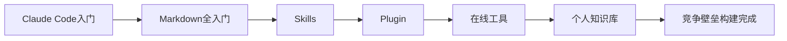
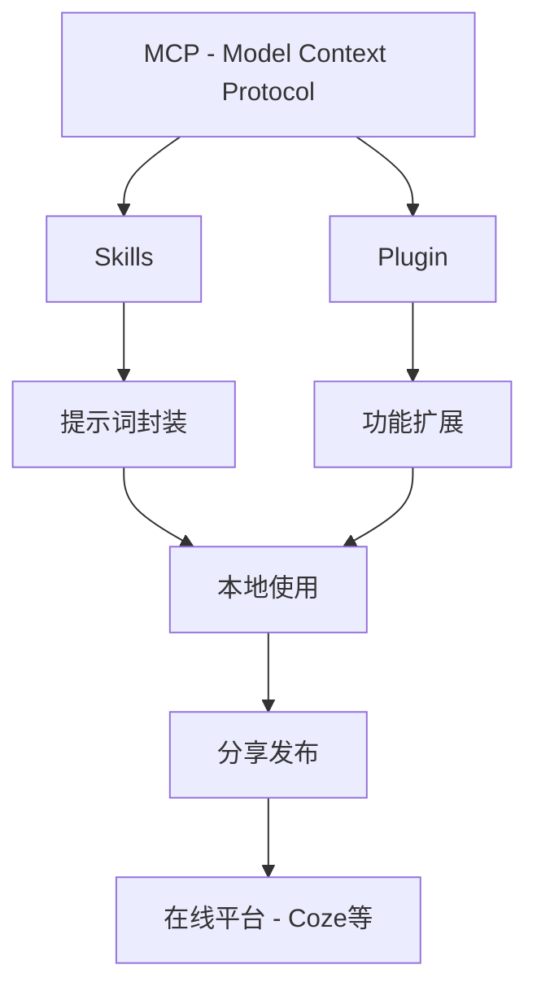

# 壁垒构建

---

## 一、章节概述

### 本章简介

恭喜你完成了流程闭环！现在你已经掌握了工作流编排能力，能够实现端到端的自动化。

本章将带你进入**竞争壁垒构建**的世界。在前面的章节中，你学会了使用现有的工具和平台。而在这一章，你将学会打造属于自己的AI工具——从Claude Code到自定义Skills、Plugin，再到个人知识库的沉淀。这些能力将帮助你构建他人难以复制的效率优势。

### 学习目标

完成本章学习后，你将获得：

- **认知目标**: 理解MCP协议、Skills、Plugin的概念和价值
- **技能目标**: 掌握Claude Code、Markdown、自定义技能开发
- **应用目标**: 能够打造专属AI应用，建立个人/团队的知识壁垒

---

## 二、核心内容模块

本章包含六个核心模块，循序渐进地帮助你构建竞争壁垒：

### 模块一：Claude Code入门

**📄 [查看详情](04_01_Claude_Code入门.md)**

- Claude Code是什么——Anthropic官方AI编程助手
- Claude Code为什么必要——不止于写代码
  - 基本代码撰写
  - 管理本地文件（Markdown知识管理）
- 本地安装Claude Code
- 使用自己的AI API
  - 如何获取API Key
  - 如何选择模型
  - 如何配置

> 学完这个模块，你将掌握Claude Code的使用方法，为后续的Skills和Plugin开发打下基础。

### 模块二：AI好搭档——Markdown全入门

**📄 [查看详情](04_02_markdown全入门.md)**

- 什么是Markdown
  - 编辑快捷
  - 适合AI处理
  - 体量小
  - 其他优点
- Markdown基础语法速查
- 如何让Markdown美观显示（Obsidian/Typora）
- 常用小技巧

> 学完这个模块，你将掌握Markdown这一AI时代的核心文档格式，为知识管理打下基础。

### 模块三：Skills

**📄 [查看详情](04_03_Skills.md)**

- MCP入门——Model Context Protocol简介
- 什么是Skills——AI能力的封装
- 最简单的Skills样式
- 使用AI完成一个Skills
- 本地编辑好的Skills如何安装使用
- 让别人也能使用你的Skills
- Skills拓展——添加脚本提升功能

> 学完这个模块，你将能够创建和分享自己的AI技能，让AI更好地服务于你的特定需求。

### 模块四：Plugin

**📄 [查看详情](04_04_plugin.md)**

- 什么是Plugin——AI能力的功能扩展
- Plugin和Skills的异同（都属于MCP生态）
- 让AI写一个Plugin
- 部署Plugin
- 如何让别人也能使用自己的Plugin

> 学完这个模块，你将掌握Plugin的开发和部署，进一步扩展AI的能力边界。

### 模块五：在线Skills/Plugin工具

**📄 [查看详情](04_05_在线工具.md)**

- 在线工具概述
- Coze平台深度使用
  - 创建Bot
  - 添加Skills和Plugin
  - 发布与分享
- Dify入门
- 工具选择建议

> 学完这个模块，你将掌握主流在线AI开发平台，无需本地部署也能创建强大的AI应用。

### 模块六：个人知识库沉淀方案

**📄 [查看详情](04_06_个人知识库沉淀方案.md)**

- 为什么需要个人知识库
- 知识库架构设计
- 知识库工具选择（Obsidian/Notion/本地文件）
- 与AI结合的知识管理
- 知识库的持续维护
- 实战案例

> 学完这个模块，你将建立自己的知识管理体系，让知识和经验得以沉淀和复用。

---

## 三、学习路径建议

### 学习顺序

1. **掌握工具**：从Claude Code开始，学会使用AI编程助手
2. **打好基础**：学习Markdown，掌握AI友好的文档格式
3. **封装能力**：学习Skills，将常用提示词模板化
4. **扩展功能**：学习Plugin，让AI能做更多事情
5. **云端部署**：学习在线工具，让技能更易分享
6. **沉淀知识**：建立个人知识库，形成长期竞争力

### 预期成果

完成本章学习后，你将能够：

| 能力维度 | 学习前 | 学习后 |
|---------|--------|--------|
| AI交互方式 | 只能用网页版对话 | 可以通过API、Skills、Plugin多方式交互 |
| 知识管理 | 信息碎片化、难以复用 | 结构化知识库、AI可读可检索 |
| 工具使用 | 依赖现有工具 | 能够定制开发专属工具 |
| 竞争优势 | 使用和别人一样的工具 | 拥有他人难以复制的效率优势 |

---

## 四、下一步

达成本章成果后，你将解锁下一章节：

**→ [05_产品化入门](../05_产品化入门/05_00_index.md)**

在下一章中，你将学习如何将自己的AI能力产品化，让更多人能够使用你创建的工具。

---

## 附录

### MCP生态关系图

### 常用工具对比

| 工具名称 | 类型 | 特点 | 适用场景 |
|---------|------|------|---------|
| Claude Code | AI编程助手 | 官方出品、能力强大 | 代码开发、文件管理 |
| Obsidian | 知识管理 | 双向链接、插件丰富 | 个人知识库 |
| Coze | 在线平台 | 易上手、AI能力强 | 快速创建AI Bot |
| Dify | 开源平台 | 可私有部署 | 企业AI应用 |

### 推荐资源

- [常用工具指南](../常用工具/index.md)
- [常见名词解释](../常见名词解释.md)

### 术语表

本章涉及的核心术语：

- **MCP（Model Context Protocol）**: 一种让AI与外部工具和数据交互的协议标准
- **Skills**: 基于MCP的技能封装，通常是提示词模板的标准化
- **Plugin**: 基于MCP的功能扩展，让AI能够执行特定操作
- **Claude Code**: Anthropic官方推出的AI编程助手工具
- **Markdown**: 一种轻量级标记语言，特别适合AI处理和知识管理
- **知识库**: 结构化存储个人/团队知识的系统，便于检索和复用

---

*本章是AI Navigator进阶路径的第四步。掌握壁垒构建能力，你将拥有他人难以复制的核心竞争力！*
