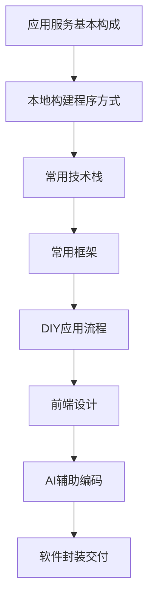

# 产品化入门

---

## 一、章节概述

### 本章简介

恭喜你来到翡翠段位！这是AI Navigator进阶路径的重要转折点。

在前面的章节中，你已经学会了如何使用AI提升效率、构建自动化流程、沉淀个人知识库。但这些能力如果只停留在"自己能用"的层面，价值是有限的。

本章将帮助你跨越"技术使用者"到"产品创造者"的关键一步——**产品化**。我们将学习如何将AI能力封装成有界面的产品，让不懂技术的普通人也能直观地使用你创造的工具。

### 学习目标

完成本章学习后，你将获得：

- **认知目标**: 理解应用服务的基本构成，掌握前后端、数据库、操作系统的核心概念
- **技能目标**: 能够选择合适的技术栈和框架，使用AI辅助完成应用开发
- **应用目标**: 独立完成一个简单应用的从设计到打包交付的全流程

---

## 二、核心内容模块

本章包含八个核心模块，循序渐进地帮助你掌握产品化能力：

### 模块一：应用服务的基本构成

**📄 [查看详情](05_01_应用服务的基本构成.md)**

- 前端：用户看到的界面
- 后端：处理业务逻辑的服务
- 数据库：存储和管理数据
- 操作系统：Windows、macOS、Linux、安卓、iOS、鸿蒙

> 学完这个模块，你将对应用服务的整体架构有清晰的认识，理解各个组件的职责和协作方式。

### 模块二：本地构建程序的常用方式——网页应用

**📄 [查看详情](05_02_本地构建程序的常用方式.md)**

- 为什么网页应用是入门首选
- Web应用的工作原理
- 本地开发环境的搭建
- 从一个简单的HTML页面开始

> 学完这个模块，你将了解网页应用的基本原理，为后续学习打下基础。

### 模块三：常用技术栈

**📄 [查看详情](05_03_常用技术栈.md)**

- Python：简洁易学，AI生态丰富
- JavaScript/TypeScript：前后端通用，生态庞大
- Golang：高性能，部署简单
- 各技术栈的优缺点对比与选择建议

> 学完这个模块，你将能够根据项目需求选择合适的编程语言和技术栈。

### 模块四：常用框架

**📄 [查看详情](05_04_常用框架.md)**

- 为什么要用框架
- 框架脚手架（CLI）的使用
- 前端框架：Vue、React
- 后端框架：FastAPI、Django（Python）、Gin、GF（Go）
- 全栈框架：Wails等

> 学完这个模块，你将掌握主流框架的特点和使用场景，能够快速搭建应用骨架。

### 模块五：开始DIY一个应用的流程

**📄 [查看详情](05_05_开始DIY一个应用的流程.md)**

- 设计前端页面
- 设计数据库
- 设计后端逻辑
- 三者的协作关系

> 学完这个模块，你将掌握从零开始构建应用的完整流程和方法论。

### 模块六：前端设计

**📄 [查看详情](05_06_前端设计.md)**

- Figma：专业级UI设计工具
- Pencil：轻量级原型设计
- 设计原则与最佳实践
- 从设计稿到代码的转换

> 学完这个模块，你将能够设计出美观、易用的用户界面。

### 模块七：使用Claude完成代码内容

**📄 [查看详情](05_07_使用Claude完成代码内容.md)**

- 如何用AI辅助前端开发
- 如何用AI辅助后端开发
- 代码调试与优化技巧
- AI编程的最佳实践

> 学完这个模块，你将能够高效地利用AI完成代码编写，大幅提升开发效率。

### 模块八：软件封装和交付

**📄 [查看详情](05_08_软件封装和交付.md)**

- 为什么要封装
- Python打包方案
- Go打包方案
- Electron打包方案
- Wails项目打包
- 交付给用户的最佳实践

> 学完这个模块，你将能够将开发完成的应用打包成可分发的程序，交付给最终用户。

---

## 三、本章学习建议

### 学习路径

### 实践建议

1. **边学边做**：每学完一个模块，都要动手实践
2. **从小做起**：先做一个简单的工具，再逐步增加功能
3. **善用AI**：Claude、ChatGPT是你最好的编程助手
4. **多看多改**：参考开源项目，学习优秀的代码结构

### 前置知识

- 基本的电脑操作能力
- 了解AI的基本使用方法（前面章节已覆盖）
- 不需要编程基础（本章会从零开始讲解）

---

## 四、下一步

达成本章成果后，你将解锁下一章节：

**→ [06_公网开放](../06_公网开放/06_00_index.md)**

在下一章中，你将学习如何将本地应用部署到公网，让更多人能够访问和使用你创造的产品。

---

## 附录

### 技术选型速查表

| 场景 | 推荐技术栈 | 理由 |
|------|-----------|------|
| 快速原型 | Python + Streamlit | 代码量少，上手快 |
| 桌面应用 | Wails（Go + 前端） | 性能好，打包体积小 |
| Web应用 | Vue/React + FastAPI | 生态成熟，资料丰富 |
| 简单工具 | Python + Tkinter | 无需前端知识 |

### 推荐资源

- [常用工具指南](../常用工具/index.md)
- [常见名词解释](../常见名词解释.md)

### 术语表

本章涉及的基础术语：

- **前端（Frontend）**：用户直接看到和操作的界面部分
- **后端（Backend）**：运行在服务器上，处理业务逻辑的部分
- **数据库（Database）**：用于存储、管理和检索数据的系统
- **框架（Framework）**：提供基础结构和工具的代码库，帮助快速开发
- **API（Application Programming Interface）**：应用程序接口，不同软件之间的通信桥梁
- **CLI（Command Line Interface）**：命令行界面，通过文本命令操作程序
- **打包（Build/Package）**：将源代码转换为可执行程序的过程

---

*产品化是将你的AI能力放大十倍的关键一步。一个优秀的产品，能让你的工具帮助到更多人！*
