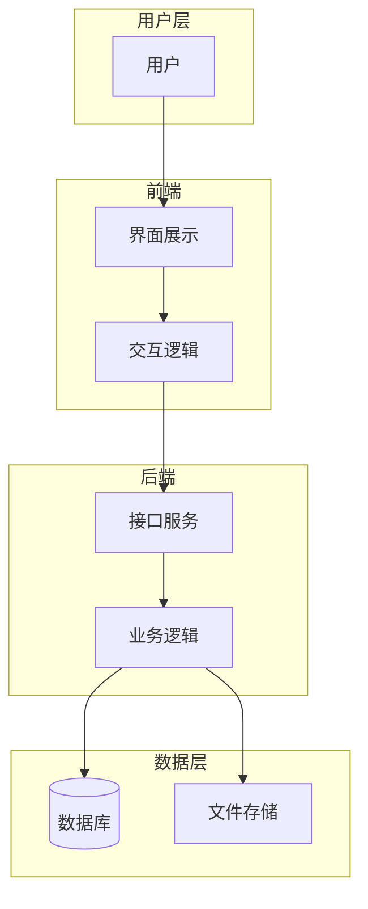
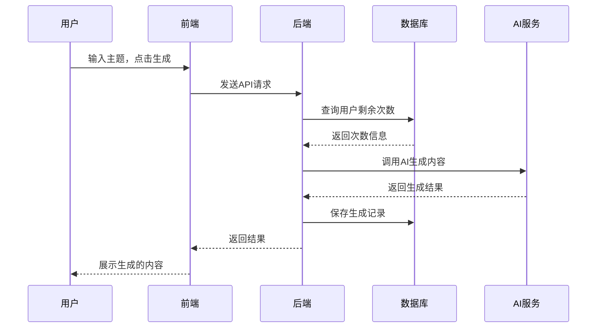

# 应用服务的基本构成

> **模块目标**: 理解一个完整应用由哪些部分组成，各部分的职责是什么

---

## 一、为什么需要了解应用构成

在开始开发一个应用之前，我们需要先理解它的整体架构。就像盖房子之前，你需要知道房子由地基、墙体、屋顶、水电系统等组成一样。

**了解应用构成的好处：**

| 好处 | 说明 |
|-----|------|
| **全局视野** | 知道每个部分在整体中的位置和作用 |
| **技术选型** | 能够根据需求选择合适的技术方案 |
| **问题定位** | 出现问题时知道从哪里入手排查 |
| **沟通协作** | 能够与开发者有效沟通 |

---

## 二、应用的四大组成部分

一个完整的应用服务通常由四个核心部分组成：



### 2.1 前端（Frontend）

**前端就是用户看到和操作的界面。**

#### 前端的职责

| 职责 | 说明 | 示例 |
|-----|------|------|
| **界面展示** | 将数据以美观的方式呈现给用户 | 网页布局、按钮样式、颜色搭配 |
| **用户交互** | 响应用户的点击、输入等操作 | 表单提交、按钮点击、页面跳转 |
| **数据展示** | 将后端返回的数据渲染到界面 | 列表展示、图表绘制、详情页 |
| **输入验证** | 在提交前验证用户输入的合法性 | 手机号格式、必填项检查 |

#### 前端技术示例

```
用户看到的：
┌─────────────────────────────────┐
│  📱 AI写作助手                    │
├─────────────────────────────────┤
│                                 │
│  请输入主题：[____________]      │
│                                 │
│  文章类型：○ 文案  ○ 报告  ○ 邮件 │
│                                 │
│        [  开始生成  ]            │
│                                 │
└─────────────────────────────────┘
```

#### 常见前端形式

| 形式 | 说明 | 示例 |
|-----|------|------|
| **网页应用** | 通过浏览器访问 | 网页版ChatGPT |
| **桌面应用** | 安装在电脑上的软件 | 微信电脑版 |
| **移动应用** | 手机APP | 抖音、淘宝 |
| **小程序** | 嵌入在超级APP中 | 微信小程序 |

---

### 2.2 后端（Backend）

**后端是运行在服务器上，处理业务逻辑的部分。用户看不到，但它是应用的大脑。**

#### 后端的职责

| 职责 | 说明 | 示例 |
|-----|------|------|
| **接收请求** | 接收前端发来的请求 | 用户点击"生成"按钮 |
| **业务处理** | 执行核心业务逻辑 | 调用AI接口生成内容 |
| **数据操作** | 与数据库交互，存取数据 | 保存生成记录、读取用户信息 |
| **返回响应** | 将处理结果返回给前端 | 返回生成的内容 |

#### 后端工作流程示例

```
用户操作：点击"生成文案"
    ↓
前端：发送请求到后端
    ↓
后端接收请求：
    1. 验证用户身份（是否登录？）
    2. 检查参数（主题是否为空？）
    3. 调用AI服务（发送请求给OpenAI）
    4. 获取AI返回的内容
    5. 保存生成记录到数据库
    6. 返回结果给前端
    ↓
前端：展示生成的内容
```

#### API的概念

**API（Application Programming Interface）** 是前后端通信的桥梁。

可以把API想象成餐厅的服务员：
- 你（前端）告诉服务员（API）你想要什么
- 服务员去厨房（后端）传达你的需求
- 厨房做好后交给服务员
- 服务员把菜端给你

```
前端 → API请求 → 后端处理 → API响应 → 前端
```

---

### 2.3 数据库（Database）

**数据库是用于存储、管理和检索数据的仓库。**

#### 为什么需要数据库？

想象一下，如果没有数据库：
- 用户注册的信息存在哪里？
- 用户生成的文章怎么保存？
- 下次登录怎么知道你是谁？

#### 常见数据库类型

| 类型 | 特点 | 适用场景 | 代表产品 |
|-----|------|---------|---------|
| **关系型数据库** | 结构化存储，支持SQL查询 | 需要事务、复杂查询 | MySQL、PostgreSQL、SQLite |
| **文档数据库** | 灵活的数据结构 | 数据格式多变 | MongoDB |
| **键值数据库** | 简单快速 | 缓存、会话存储 | Redis |
| **向量数据库** | 存储向量数据 | AI语义搜索 | Milvus、Pinecone |

#### 数据库操作示例

```sql
-- 存储用户信息
INSERT INTO users (name, email) VALUES ('张三', 'zhangsan@example.com');

-- 查询用户信息
SELECT * FROM users WHERE email = 'zhangsan@example.com';

-- 更新用户信息
UPDATE users SET name = '李四' WHERE id = 1;

-- 删除用户
DELETE FROM users WHERE id = 1;
```

> 💡 **好消息**：在实际开发中，很多数据库操作可以通过ORM（对象关系映射）工具完成，不需要手写SQL。

---

### 2.4 操作系统（Operating System）

**操作系统是应用运行的基础环境。**

#### 主要操作系统平台

| 平台 | 代表系统 | 应用形式 | 特点 |
|-----|---------|---------|------|
| **桌面端** | Windows、macOS、Linux | 桌面软件 | 性能强，功能完整 |
| **移动端** | Android、iOS、鸿蒙 | 手机APP | 便携，使用场景丰富 |
| **服务器端** | Linux（CentOS、Ubuntu） | 后端服务 | 稳定，安全 |

#### 跨平台开发

为了减少开发成本，现在有很多跨平台方案：

| 方案 | 一套代码运行平台 | 代表框架 |
|-----|----------------|---------|
| **跨平台桌面应用** | Windows、macOS、Linux | Electron、Tauri、Wails |
| **跨平台移动应用** | Android、iOS | Flutter、React Native |
| **响应式网页** | 所有平台（浏览器） | Vue、React |

---

## 三、各部分如何协作

### 3.1 一个完整的请求流程

以"AI写作助手"为例，看看各部分如何协作：



### 3.2 数据流转示意

```
【用户输入】
主题：如何提高工作效率

    ↓ 前端封装请求

【前端发送】
POST /api/generate
{
  "topic": "如何提高工作效率",
  "type": "article"
}

    ↓ 后端处理

【后端逻辑】
1. 验证用户登录状态
2. 检查剩余次数
3. 调用AI接口
4. 保存记录

    ↓ 数据库操作

【数据库存储】
INSERT INTO generations 
(user_id, topic, content, created_at)
VALUES 
(1, '如何提高工作效率', '...', '2024-01-01')

    ↓ 返回结果

【后端响应】
{
  "success": true,
  "content": "提高工作效率的10个方法..."
}

    ↓ 前端展示

【用户看到】
生成完成！
提高工作效率的10个方法...
```

---

## 四、不同类型应用的架构

### 4.1 简单工具类应用

```
┌─────────────────────────────────────┐
│            单体应用                   │
│  ┌─────────┐  ┌─────────┐           │
│  │  前端    │  │  后端    │          │
│  └─────────┘  └─────────┘           │
│              ┌─────────┐            │
│              │ 数据库   │            │
│              └─────────┘            │
└─────────────────────────────────────┘
```

**特点**：所有功能在一个程序中，部署简单，适合入门。

### 4.2 Web应用

```
┌────────────┐     ┌────────────┐     ┌────────────┐
│   浏览器    │ ←→  │   服务器    │ ←→  │   数据库    │
│  （前端）   │     │  （后端）   │     │            │
└────────────┘     └────────────┘     └────────────┘
```

**特点**：前后端分离，通过HTTP通信，可独立部署。

### 4.3 桌面应用

```
┌─────────────────────────────────────┐
│           桌面应用程序                │
│  ┌─────────────────────────────┐    │
│  │      界面 + 业务逻辑          │    │
│  └─────────────────────────────┘    │
│  ┌─────────────────────────────┐    │
│  │      本地数据库/文件          │    │
│  └─────────────────────────────┘    │
└─────────────────────────────────────┘
```

**特点**：运行在本地，可离线使用，需要安装。

---

## 五、本章小结

### 核心要点回顾

1. **前端**：用户看到和操作的界面，负责展示和交互
2. **后端**：处理业务逻辑的服务，是应用的大脑
3. **数据库**：存储和管理数据的仓库
4. **操作系统**：应用运行的基础环境

### 架构选择建议

| 场景 | 推荐架构 | 理由 |
|-----|---------|------|
| 个人小工具 | 单体应用 | 简单直接，易于开发 |
| 需要多人访问 | Web应用 | 可通过浏览器访问，无需安装 |
| 需要离线使用 | 桌面应用 | 数据在本地，不依赖网络 |

### 自检清单

完成本模块学习后，问问自己：

- [ ] 我能说出应用的四个核心组成部分吗？
- [ ] 我理解前端和后端的职责区别吗？
- [ ] 我知道数据库是用来做什么的吗？
- [ ] 我能描述一个请求从前端到后端的完整流程吗？

### 下一步

理解应用的基本构成后，接下来我们将学习如何本地构建程序：

**→ [本地构建程序的常用方式](05_02_本地构建程序的常用方式.md)**

---

*理解架构是开发的第一步。不必急于掌握所有细节，先建立全局认知！*
