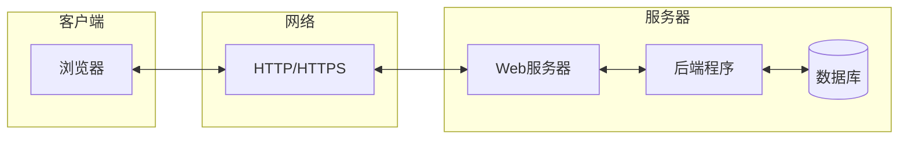

# 本地构建程序的常用方式——网页应用

> **模块目标**: 理解为什么网页应用是入门首选，掌握Web应用的基本原理和开发环境搭建

---

## 一、为什么选择网页应用

对于初学者来说，网页应用（Web Application）是入门产品化的最佳选择。

### 1.1 网页应用的优势

| 优势 | 说明 |
|-----|------|
| **零安装** | 用户只需打开浏览器即可使用，无需下载安装 |
| **跨平台** | 一套代码，Windows、Mac、Linux、手机都能用 |
| **易分享** | 发送链接就能让别人使用你的产品 |
| **开发快** | 丰富的框架和工具，快速实现想法 |
| **调试方便** | 浏览器自带开发者工具，实时查看效果 |
| **学习资源多** | 网上教程、文档、社区支持丰富 |

### 1.2 与其他方式的对比

| 方式 | 开发难度 | 用户使用 | 跨平台 | 适合场景 |
|-----|---------|---------|--------|---------|
| **网页应用** | ⭐⭐ | 打开即用 | ✅ 完美 | 工具类、内容类应用 |
| **桌面应用** | ⭐⭐⭐ | 需要安装 | ⚠️ 需适配 | 需要本地性能、离线使用 |
| **移动APP** | ⭐⭐⭐⭐ | 应用商店下载 | ⚠️ 需分别开发 | 需要推送、传感器 |
| **小程序** | ⭐⭐⭐ | 微信内使用 | ✅ 跨平台 | 依赖微信生态 |

### 1.3 网页应用能做什么

**AI工具类**：
- AI写作助手
- AI翻译工具
- AI图片生成器界面
- 文档总结工具

**效率工具类**：
- 待办事项管理
- 笔记工具
- 数据可视化面板
- 表单收集工具

---

## 二、Web应用的工作原理

### 2.1 基本概念

Web应用基于 **客户端-服务器（Client-Server）** 模式：



### 2.2 请求-响应流程

当你在浏览器中访问一个网页时：

```
1. 用户在浏览器输入网址或点击按钮
        ↓
2. 浏览器发送HTTP请求到服务器
        ↓
3. 服务器接收请求，处理后端逻辑
        ↓
4. 服务器返回HTTP响应（HTML/CSS/JS/数据）
        ↓
5. 浏览器解析响应，渲染页面
        ↓
6. 用户看到结果
```

### 2.3 前后端分离 vs 不分离

#### 传统方式（前后端不分离）

```
浏览器请求 → 服务器生成完整HTML → 返回给浏览器
```

**特点**：页面由服务器渲染，适合内容展示型网站。

#### 现代方式（前后端分离）

```
浏览器请求HTML → 加载JS → JS请求数据 → 渲染页面
```

**特点**：前端负责界面，后端只提供数据API，适合交互丰富的应用。

> 💡 **建议**：初学者可以先从简单的HTML页面开始，逐步过渡到前后端分离架构。

---

## 三、从零开始：一个简单的网页

### 3.1 最简单的HTML页面

创建一个名为 `index.html` 的文件：

```html
<!DOCTYPE html>
<html lang="zh-CN">
<head>
    <meta charset="UTF-8">
    <title>我的第一个网页</title>
</head>
<body>
    <h1>你好，世界！</h1>
    <p>这是我的第一个网页应用</p>
</body>
</html>
```

**直接双击打开这个文件，你就能在浏览器中看到效果！**

### 3.2 添加样式（CSS）

CSS让网页变得美观：

```html
<!DOCTYPE html>
<html lang="zh-CN">
<head>
    <meta charset="UTF-8">
    <title>我的第一个网页</title>
    <style>
        body {
            font-family: Arial, sans-serif;
            max-width: 800px;
            margin: 50px auto;
            padding: 20px;
            background-color: #f5f5f5;
        }
        h1 {
            color: #333;
            text-align: center;
        }
        .card {
            background: white;
            padding: 20px;
            border-radius: 8px;
            box-shadow: 0 2px 10px rgba(0,0,0,0.1);
        }
    </style>
</head>
<body>
    <h1>🤖 AI写作助手</h1>
    <div class="card">
        <p>输入主题，AI帮你生成文章</p>
        <input type="text" placeholder="请输入文章主题" style="width: 100%; padding: 10px;">
        <button style="margin-top: 10px; padding: 10px 20px;">生成文章</button>
    </div>
</body>
</html>
```

### 3.3 添加交互（JavaScript）

JavaScript让网页动起来：

```html
<!DOCTYPE html>
<html lang="zh-CN">
<head>
    <meta charset="UTF-8">
    <title>AI写作助手</title>
    <style>
        /* 样式同上 */
    </style>
</head>
<body>
    <h1>🤖 AI写作助手</h1>
    <div class="card">
        <input type="text" id="topic" placeholder="请输入文章主题">
        <button onclick="generate()">生成文章</button>
        <div id="result" style="margin-top: 20px;"></div>
    </div>

    <script>
        function generate() {
            const topic = document.getElementById('topic').value;
            if (!topic) {
                alert('请输入主题！');
                return;
            }
            
            // 模拟AI生成（实际项目中会调用后端API）
            document.getElementById('result').innerHTML = `
                <h3>生成结果</h3>
                <p>关于「${topic}」的文章已生成...</p>
                <p>（这里将来会显示AI生成的内容）</p>
            `;
        }
    </script>
</body>
</html>
```

---

## 四、本地开发环境搭建

### 4.1 基础工具

| 工具 | 用途 | 推荐选择 |
|-----|------|---------|
| **代码编辑器** | 编写代码 | VS Code（免费、强大） |
| **浏览器** | 查看效果 | Chrome / Edge |
| **终端** | 运行命令 | 系统自带 / VS Code内置 |

### 4.2 VS Code 必装插件

| 插件 | 功能 |
|-----|------|
| **Chinese Language Pack** | 中文界面 |
| **Live Server** | 本地开发服务器，修改代码自动刷新 |
| **Auto Rename Tag** | 自动重命名HTML标签 |
| **Prettier** | 代码格式化 |

### 4.3 使用Live Server

安装Live Server后：

1. 用VS Code打开你的项目文件夹
2. 右键点击 `index.html`
3. 选择 "Open with Live Server"
4. 浏览器自动打开，修改代码后自动刷新

```
┌─────────────────────────────────────────┐
│  VS Code                                 │
│  ┌─────────────┐  ┌─────────────────┐   │
│  │ 代码编辑区   │  │  文件管理器      │   │
│  │             │  │  📁 my-project  │   │
│  │ index.html  │  │    📄 index.html│   │
│  │             │  │                 │   │
│  └─────────────┘  └─────────────────┘   │
└─────────────────────────────────────────┘
           ↓ Live Server
┌─────────────────────────────────────────┐
│  浏览器                                  │
│  ┌─────────────────────────────────────┐│
│  │ http://127.0.0.1:5500               ││
│  │                                     ││
│  │     🤖 AI写作助手                    ││
│  │     [实时预览效果]                   ││
│  └─────────────────────────────────────┘│
└─────────────────────────────────────────┘
```

---

## 五、本地开发 vs 部署上线

### 5.1 开发阶段

```
你的电脑（本地）
├── 编写代码
├── 本地运行测试
└── 调试修改
```

**特点**：只有你自己能访问，方便调试。

### 5.2 部署阶段

```
服务器（云端）
├── 上传代码
├── 配置环境
└── 对外提供服务
```

**特点**：其他人可以通过网址访问。

### 5.3 常见部署方式

| 方式 | 难度 | 费用 | 适合场景 |
|-----|------|------|---------|
| **静态托管** | ⭐ | 免费/低价 | 纯前端应用 |
| **云服务器** | ⭐⭐⭐ | 按需付费 | 需要后端的应用 |
| **容器部署** | ⭐⭐⭐⭐ | 按需付费 | 复杂应用 |
| **Serverless** | ⭐⭐ | 按调用付费 | 轻量级后端 |

> 💡 **提示**：部署相关内容将在后续章节「公网开放」中详细讲解。

---

## 六、网页应用的局限

虽然网页应用很强大，但也有其局限性：

| 局限 | 说明 | 解决方案 |
|-----|------|---------|
| **无法直接访问本地文件** | 浏览器安全限制 | 需要用户选择上传 |
| **离线能力有限** | 没网时无法使用 | PWA技术（进阶） |
| **性能受限** | 不如原生应用 | WebAssembly（进阶） |
| **无法使用某些硬件** | 如蓝牙、串口 | 需要桌面应用 |

---

## 七、实战练习

### 练习1：创建你的第一个网页

1. 创建一个文件夹 `my-first-app`
2. 在其中创建 `index.html`
3. 写一个简单的自我介绍页面
4. 用浏览器打开查看效果

### 练习2：添加交互

1. 添加一个按钮
2. 点击按钮后显示一段文字
3. 尝试修改样式让页面更美观

---

## 八、本章小结

### 核心要点回顾

1. **网页应用**是入门产品化的最佳选择：零安装、跨平台、易分享
2. **工作原理**：浏览器发送请求 → 服务器处理 → 返回响应 → 浏览器渲染
3. **三大基础技术**：HTML（结构）、CSS（样式）、JavaScript（交互）
4. **开发环境**：VS Code + Live Server 就足够开始

### 学习路径

```
HTML基础 → CSS美化 → JavaScript交互 → 后端API → 完整应用
```

### 自检清单

完成本模块学习后，问问自己：

- [ ] 我能说出网页应用的3个优势吗？
- [ ] 我理解浏览器和服务器是如何通信的吗？
- [ ] 我能创建一个简单的HTML页面吗？
- [ ] 我已经安装好VS Code和必要的插件了吗？

### 下一步

掌握了网页应用的基础后，接下来我们将了解常用的技术栈：

**→ [常用技术栈](05_03_常用技术栈.md)**

---

*网页应用是产品化的最佳起点。从简单的HTML页面开始，一步步构建你的第一个产品！*
