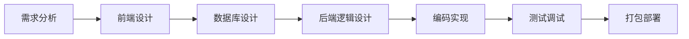
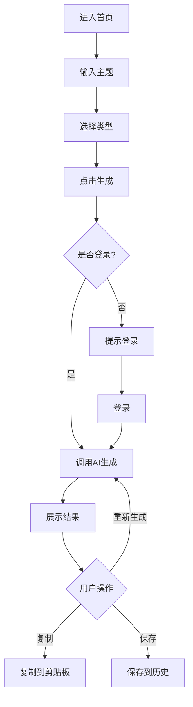
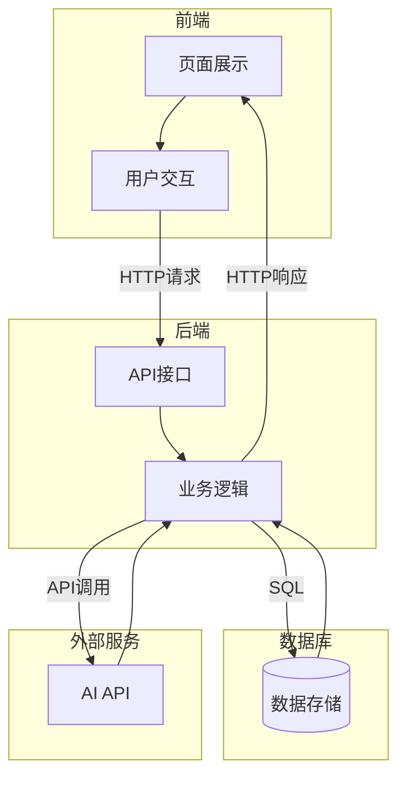

# 开始DIY一个应用的流程

> **模块目标**: 理解应用开发的完整流程，学会设计前端页面、数据库和后端逻辑的方法论

---

## 一、应用开发的全流程

### 1.1 开发流程概览

从想法到产品，通常需要经历以下阶段：



### 1.2 各阶段的核心任务

| 阶段 | 核心任务 | 输出物 |
|-----|---------|--------|
| **需求分析** | 明确要做什么、给谁用、解决什么问题 | 需求文档 |
| **前端设计** | 设计界面布局、交互流程 | 设计稿/原型 |
| **数据库设计** | 设计数据结构、存储方案 | 数据库表结构 |
| **后端逻辑设计** | 设计API接口、业务流程 | API文档 |
| **编码实现** | 写代码实现功能 | 可运行的程序 |
| **测试调试** | 发现并修复问题 | 稳定的程序 |
| **打包部署** | 封装成可分发的产品 | 安装包/部署服务 |

---

## 二、设计前端页面

### 2.1 前端设计的核心要素

前端设计需要考虑三个层面：

```
┌─────────────────────────────────────┐
│           视觉设计                   │  好不好看
│  颜色、字体、间距、图标              │
├─────────────────────────────────────┤
│           交互设计                   │  好不好用
│  按钮反馈、表单验证、页面跳转        │
├─────────────────────────────────────┤
│           信息架构                   │  清不清晰
│  页面结构、导航逻辑、内容组织        │
└─────────────────────────────────────┘
```

### 2.2 页面设计流程

#### 第一步：梳理页面清单

列出应用需要的所有页面：

```
【AI写作助手 - 页面清单】
1. 首页/工具页 - 主要功能入口
2. 历史记录页 - 查看生成历史
3. 设置页 - 配置API等
4. 登录页 - 用户登录（可选）
```

#### 第二步：绘制页面草图

用纸笔或工具画出每个页面的布局：

```
┌─────────────────────────────────────┐
│  🤖 AI写作助手            [设置]    │
├─────────────────────────────────────┤
│                                     │
│  请输入文章主题：                    │
│  ┌─────────────────────────────┐   │
│  │                             │   │
│  └─────────────────────────────┘   │
│                                     │
│  文章类型：                         │
│  ○ 文案  ○ 报告  ○ 邮件  ○ 文章    │
│                                     │
│  ┌─────────────────────────────┐   │
│  │        开始生成              │   │
│  └─────────────────────────────┘   │
│                                     │
├─────────────────────────────────────┤
│  [首页]    [历史]    [我的]         │
└─────────────────────────────────────┘
```

#### 第三步：确定交互流程

梳理用户操作的流程：



### 2.3 设计原则

| 原则 | 说明 | 示例 |
|-----|------|------|
| **简洁** | 去掉不必要的元素 | 一个页面一个核心功能 |
| **一致** | 统一的设计语言 | 按钮样式、间距保持一致 |
| **反馈** | 及时响应用户操作 | 点击按钮有loading状态 |
| **容错** | 防止用户犯错 | 输入验证、确认提示 |

---

## 三、设计数据库

### 3.1 数据库设计的核心思路

数据库设计的本质是：**把现实世界的实体和关系，映射成数据库的表和关联**。

```
现实世界          →        数据库
─────────────────────────────────
用户（实体）       →        users 表
文章（实体）       →        articles 表
用户写文章（关系）  →        外键关联
```

### 3.2 数据库设计流程

#### 第一步：识别数据实体

问自己：这个应用需要存储什么数据？

```
【AI写作助手 - 数据实体】
1. 用户 - 账号信息
2. 生成记录 - 用户生成的文章
3. 配置 - 用户偏好设置
```

#### 第二步：设计表结构

为每个实体设计具体的字段：

**用户表 (users)**
| 字段名 | 类型 | 说明 |
|-------|------|------|
| id | INTEGER | 主键，自增 |
| username | VARCHAR | 用户名 |
| email | VARCHAR | 邮箱 |
| password_hash | VARCHAR | 密码哈希 |
| created_at | DATETIME | 创建时间 |

**生成记录表 (generations)**
| 字段名 | 类型 | 说明 |
|-------|------|------|
| id | INTEGER | 主键，自增 |
| user_id | INTEGER | 用户ID（外键） |
| topic | VARCHAR | 文章主题 |
| type | VARCHAR | 文章类型 |
| content | TEXT | 生成内容 |
| created_at | DATETIME | 创建时间 |

#### 第三步：确定表关系

```
users (1) ←─────→ (N) generations
一个用户可以有多条生成记录
一条生成记录属于一个用户
```

### 3.3 数据库设计原则

| 原则 | 说明 |
|-----|------|
| **每个表有主键** | 唯一标识每条记录 |
| **避免数据冗余** | 不要重复存储相同数据 |
| **合理使用索引** | 加快查询速度 |
| **考虑扩展性** | 预留字段空间 |

### 3.4 简单应用的数据库选择

| 数据库 | 适用场景 | 特点 |
|-------|---------|------|
| **SQLite** | 本地应用、小项目 | 零配置、单文件 |
| **MySQL** | Web应用 | 主流、资料多 |
| **PostgreSQL** | 复杂应用 | 功能强大 |
| **MongoDB** | 灵活数据结构 | 文档型数据库 |

> 💡 **建议**：初学者首选SQLite，零配置，一个文件就是一个数据库。

---

## 四、设计后端逻辑

### 4.1 后端设计的核心任务

后端是应用的"大脑"，负责处理业务逻辑。

```
后端的三大职责：
1. 接收请求 - 解析前端发来的数据
2. 处理业务 - 执行核心逻辑
3. 返回响应 - 返回处理结果
```

### 4.2 API设计

#### RESTful API 规范

RESTful是一种API设计风格，让接口清晰易懂：

| 操作 | HTTP方法 | URL | 说明 |
|-----|---------|-----|------|
| 获取列表 | GET | /api/articles | 获取所有文章 |
| 获取详情 | GET | /api/articles/1 | 获取ID为1的文章 |
| 创建 | POST | /api/articles | 创建新文章 |
| 更新 | PUT | /api/articles/1 | 更新ID为1的文章 |
| 删除 | DELETE | /api/articles/1 | 删除ID为1的文章 |

#### API设计示例

```
【AI写作助手 - API设计】

POST /api/generate
功能：生成文章
请求：
{
  "topic": "如何提高工作效率",
  "type": "article"
}
响应：
{
  "success": true,
  "data": {
    "content": "生成的内容...",
    "word_count": 500
  }
}

GET /api/history
功能：获取生成历史
响应：
{
  "success": true,
  "data": [
    {
      "id": 1,
      "topic": "如何提高工作效率",
      "type": "article",
      "created_at": "2024-01-01 10:00:00"
    }
  ]
}
```

### 4.3 业务逻辑设计

#### 核心业务流程

```
【生成文章的业务流程】

1. 接收请求
   ↓
2. 验证参数
   - topic是否为空？
   - type是否合法？
   ↓
3. 验证用户
   - 用户是否登录？
   - 是否有剩余次数？
   ↓
4. 调用AI服务
   - 构建prompt
   - 调用AI API
   - 获取生成结果
   ↓
5. 保存记录
   - 存入数据库
   ↓
6. 返回结果
```

### 4.4 后端代码组织

推荐的项目结构：

```
my-app/
├── main.py              # 入口文件
├── config.py            # 配置文件
├── routers/             # 路由/API
│   ├── generate.py
│   └── history.py
├── services/            # 业务逻辑
│   ├── ai_service.py
│   └── user_service.py
├── models/              # 数据模型
│   └── models.py
└── utils/               # 工具函数
    └── helpers.py
```

---

## 五、三者的协作关系

### 5.1 整体架构



### 5.2 数据流转示例

以"生成文章"为例：

```
【用户操作】
点击"生成"按钮
        ↓
【前端】
1. 收集表单数据
2. 发送POST请求到 /api/generate
        ↓
【后端】
1. 接收请求参数
2. 验证用户身份
3. 构建AI prompt
4. 调用AI API
        ↓
【AI服务】
返回生成的内容
        ↓
【后端】
5. 保存记录到数据库
6. 返回结果给前端
        ↓
【前端】
3. 接收响应数据
4. 渲染到页面
        ↓
【用户看到】
生成完成，展示内容
```

---

## 六、实战案例：设计一个AI翻译工具

### 6.1 需求分析

```
功能：多语言翻译工具
用户：需要翻译文档的办公人员
核心功能：
1. 输入文本，选择目标语言
2. 调用AI翻译
3. 显示翻译结果
4. 保存翻译历史
```

### 6.2 前端设计

```
页面结构：
┌─────────────────────────────────────┐
│  🌐 AI翻译工具                      │
├─────────────────────────────────────┤
│  源语言：[自动检测 ▼]  →  目标语言：[英语 ▼] │
├─────────────────────────────────────┤
│  请输入要翻译的文本：                │
│  ┌─────────────────────────────┐   │
│  │                             │   │
│  │  （文本输入框）              │   │
│  │                             │   │
│  └─────────────────────────────┘   │
│         [翻译]  [清空]              │
├─────────────────────────────────────┤
│  翻译结果：                         │
│  ┌─────────────────────────────┐   │
│  │                             │   │
│  │  （翻译结果显示）            │   │
│  │                             │   │
│  └─────────────────────────────┘   │
│         [复制]  [保存]              │
└─────────────────────────────────────┘
```

### 6.3 数据库设计

```sql
-- 翻译历史表
CREATE TABLE translations (
    id INTEGER PRIMARY KEY AUTOINCREMENT,
    source_text TEXT NOT NULL,
    source_lang VARCHAR(10),
    target_lang VARCHAR(10),
    result_text TEXT NOT NULL,
    created_at DATETIME DEFAULT CURRENT_TIMESTAMP
);
```

### 6.4 API设计

```
POST /api/translate
请求：{ "text": "你好", "source_lang": "auto", "target_lang": "en" }
响应：{ "success": true, "result": "Hello" }

GET /api/history
响应：{ "success": true, "data": [...] }
```

---

## 七、本章小结

### 核心要点回顾

1. **前端设计**：梳理页面、绘制草图、确定交互流程
2. **数据库设计**：识别实体、设计表结构、确定关系
3. **后端设计**：设计API接口、梳理业务逻辑、组织代码结构
4. **三者协作**：前端发起请求、后端处理逻辑、数据库存储数据

### 设计流程速查

```
1. 需求分析 → 明确要做什么
2. 前端设计 → 画页面草图
3. 数据库设计 → 设计表结构
4. API设计 → 定义接口规范
5. 业务逻辑 → 梳理处理流程
```

### 自检清单

完成本模块学习后，问问自己：

- [ ] 我能说出应用开发的完整流程吗？
- [ ] 我会画简单的页面草图吗？
- [ ] 我能设计简单的数据库表结构吗？
- [ ] 我理解RESTful API的设计规范吗？

### 下一步

掌握了开发流程后，接下来我们将学习前端设计的具体工具：

**→ [前端设计](05_06_前端设计.md)**

---

*好的设计是成功的一半。动手之前，先想清楚要做什么！*
