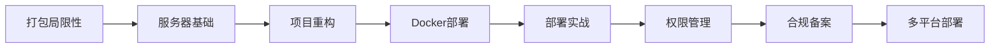

# 公网开放

---

## 一、章节概述

### 本章简介

恭喜你达到了钻石段位！这是AI Navigator进阶路径的关键里程碑。

在第五章产品化入门中，你已经学会了如何将AI能力封装成有界面的应用，并打包成可分发的程序。但打包后的程序还有局限性——用户需要下载安装、特定操作系统才能运行、难以实时更新。

本章将带你跨越到**公网开放**的世界。你将学会如何将本地应用部署到服务器上，让任何人都可以通过浏览器访问使用。从服务器基础知识到Docker容器化部署，从权限管理到合规备案，我们将系统地学习应用上线的完整流程。

### 学习目标

完成本章学习后，你将获得：

- **认知目标**: 理解服务器、域名、Docker容器等核心概念，掌握Web应用部署的基本原理
- **技能目标**: 能够独立完成应用的服务器部署、配置和管理
- **应用目标**: 将个人工具部署上线，变成任何人都可以访问的公开产品

---

## 二、核心内容模块

本章包含八个核心模块，循序渐进地帮助你掌握公网开放能力：

### 模块一：打包的局限性与产品化升级

**📄 [查看详情](06_01_打包的局限性与产品化升级.md)**

- 打包为单个文件时的局限性
  - 不利于版权保护
  - 不利于分发
  - 体积庞大
  - 用户信任问题
  - 平台局限性
- 为什么需要升级到服务端部署
- 产品化 vs 部署化的区别

> 学完这个模块，你将理解从本地打包到服务器部署的必要性，为后续学习奠定认知基础。

### 模块二：服务器基础

**📄 [查看详情](06_02_服务器基础.md)**

- 域名基础
  - 域名的构成与分类
  - 域名注册与购买
  - DNS解析原理
- IP地址与服务器
  - 公网IP vs 私网IP
  - 云服务器简介
  - 服务器选购指南
- 服务器操作系统
  - Linux vs Windows Server
  - 常用Linux发行版介绍

> 学完这个模块，你将掌握服务器和域名基础知识，为后续部署操作打下基础。

### 模块三：项目重构与后端架构

**📄 [查看详情](06_03_项目重构与后端架构.md)**

- 为什么需要重构
- 从桌面应用到Web应用
- 后端服务架构设计
- API设计原则
- 数据库选型与配置
- 环境配置与敏感信息管理

> 学完这个模块，你将能够将本地应用重构为可在服务器上运行的Web应用。

### 模块四：Docker容器化部署

**📄 [查看详情](06_04_Docker容器化部署.md)**

- Docker是什么
  - 容器技术简介
  - Docker的核心概念（镜像、容器、仓库）
- Docker的优势
  - 环境一致性
  - 隔离性
  - 可移植性
- Docker基本操作
  - 镜像管理
  - 容器生命周期
  - 数据卷挂载
- Docker Compose使用
- Dockerfile编写

> 学完这个模块，你将掌握Docker容器技术，能够高效管理服务器上的应用。

### 模块五：服务器部署实战

**📄 [查看详情](06_05_服务器部署实战.md)**

- 服务器环境初始化
- 应用部署流程
- Nginx反向代理配置
- HTTPS证书配置
- 域名解析与绑定
- 部署后的验证与调试

> 学完这个模块，你将能够独立完成应用的完整部署流程。

### 模块六：权限控制与用户管理

**📄 [查看详情](06_06_权限控制与用户管理.md)**

- 认证与授权基础
- 常见的认证方式
  - 用户名密码
  - 验证码
  - 第三方登录
- JWT令牌机制
- 密码加密存储
- 用户权限管理
- 接口访问控制

> 学完这个模块，你将掌握用户认证和权限管理，确保应用安全可控。

### 模块七：合规与备案

**📄 [查看详情](06_07_合规与备案.md)**

- 中国互联网监管体系
- ICP备案
  - 什么是ICP备案
  - 备案流程
  - 备案注意事项
- 公安联网备案
- 信息安全等级保护
- 其他合规要求
  - 数据安全法
  - 个人隐私保护

> 学完这个模块，你将了解国内网站运营的合规要求，避免法律风险。

### 模块八：拓展——小程序与多平台部署

**📄 [查看详情](06_08_拓展小程序与多平台部署.md)**

- 微信小程序简介
- 支付宝小程序
- 抖音小程序
- 跨平台部署策略
- 移动端适配
- PWA渐进式Web应用

> 学完这个模块，你将了解多平台部署的思路，扩展产品的可访问性。

---

## 三、学习路径建议

### 学习顺序

1. **理解为什么**：先了解打包的局限性，明确升级的必要性
2. **打好基础**：学习服务器、域名、IP等基础知识
3. **准备代码**：将项目重构为适合服务器部署的架构
4. **掌握工具**：学会Docker容器化技术
5. **动手实践**：完成完整的服务器部署流程
6. **保障安全**：实现用户认证和权限管理
7. **合规运营**：完成必要的备案流程
8. **持续扩展**：考虑多平台部署

### 实践建议

1. **循序渐进**：每章内容都要动手实践，不要只看不动手
2. **从小开始**：先部署一个最简单的Hello World，再逐步增加功能
3. **善用文档**：服务器、Docker等工具的官方文档是最权威的资源
4. **注意备份**：部署过程中务必做好数据和配置的备份

### 前置知识

- 完成第五章产品化入门的学习
- 了解基本的命令行操作
- 有Web应用的基础概念（第五章已覆盖）

---

## 四、下一步

达成本章成果后，你将解锁下一章节：

**→ [07_规模化运营](../07_规模化运营/07_00_index.md)**

在下一章中，你将学习如何规模化运营你的产品，包括用户增长、内容运营、社区建设等方面的知识和技能。

---

## 附录

### 服务器提供商对比

| 厂商 | 特点 | 适用场景 |
|------|------|---------|
| 阿里云 | 国内市场份额第一，生态完善 | 国内业务首选 |
| 腾讯云 | 游戏、社交流量优势 | 游戏、社交应用 |
| 华为云 | 政府、企业客户多 | 企业级应用 |
| AWS | 全球覆盖，生态丰富 | 国际化业务 |
| Vultr | 性价比高，按小时计费 | 个人开发者 |

### 常用部署工具

| 工具 | 类型 | 特点 |
|------|------|------|
| Docker | 容器化 | 环境一致，部署简单 |
| Nginx | Web服务器 | 高性能，反向代理 |
| PM2 | 进程管理 | Node.js专用 |
| Supervisor | 进程管理 | 通用进程守护 |

### 推荐资源

- [常用工具指南](../常用工具/index.md)
- [常见名词解释](../常见名词解释.md)

### 术语表

本章涉及的核心术语：

- **服务器（Server）**: 提供计算服务的计算机，运行应用程序供客户端访问
- **域名（Domain Name）**: 网站的地址标识，如example.com
- **DNS（Domain Name System）**: 域名系统，将域名解析为IP地址
- **Docker**: 开源容器化平台，用于应用的打包和部署
- **容器（Container）**: 轻量级的虚拟化技术，包含应用运行所需的环境
- **镜像（Image）**: 容器的模板，包含应用及其依赖
- **Nginx**: 高性能HTTP服务器和反向代理服务器
- **ICP备案**: 中国大陆网站的必备备案手续
- **HTTPS**: HTTP的安全版本，通过SSL/TLS加密传输

---

*从本地工具到公网服务，这是一个质的飞跃。完成本章，你将真正成为一个能够创造并运营互联网产品的人！*
