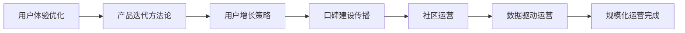
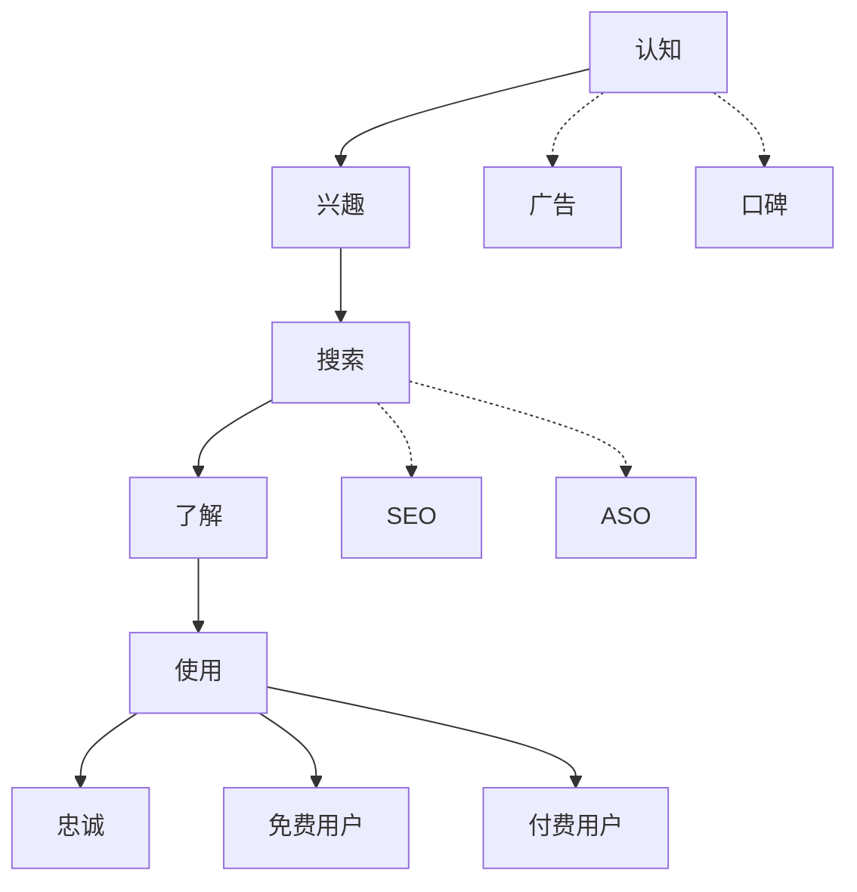

# 规模化运营

---

## 一、章节概述

### 本章简介

恭喜你达到了大师段位！这是AI Navigator进阶路径的重要里程碑。

在第六章公网开放中，你已经学会了如何将应用部署到公网，让任何人都可以访问。但一个产品的成功不仅仅是"能访问"就够了——你需要让更多人知道、使用、并爱上你的产品。

本章将带你进入**规模化运营**的世界。你将学习如何持续优化用户体验、如何制定有效的用户增长策略、如何建设产品口碑和运营社区。这些能力将帮助你的产品从"能用"变成"好用"，从"有人用"变成"用户离不开"。

### 学习目标

完成本章学习后，你将获得：

- **认知目标**: 理解用户体验、产品迭代、用户增长的核心概念和方法论
- **技能目标**: 掌握数据驱动运营、社区建设、用户运营的具体方法
- **应用目标**: 建立稳定的用户群体，实现产品的持续增长和良好口碑

---

## 二、核心内容模块

本章包含六个核心模块，循序渐进地帮助你掌握规模化运营能力：

### 模块一：用户体验优化基础

**📄 [查看详情](07_01_用户体验优化基础.md)**

- 什么是用户体验（UX）
  - 用户体验的核心要素
  - 用户体验与产品成功的关系
- 用户体验评估方法
  - 用户旅程地图
  - 可用性测试
  - 启发式评估
- 常见的用户体验问题
  - 加载速度慢
  - 导航混乱
  - 反馈缺失
- 性能优化基础
  - 前端性能指标
  - 优化策略与工具

> 学完这个模块，你将理解用户体验的重要性，掌握评估和改进用户体验的基本方法。

### 模块二：产品迭代方法论

**📄 [查看详情](07_02_产品迭代方法论.md)**

- 什么是产品迭代
  - 迭代vs一次性开发
  - 持续迭代的价值
- 敏捷开发基础
  - Scrum与Kanban
  - 短周期迭代
- 用户反馈收集
  - 反馈渠道设计
  - 反馈分析与分类
  - 反馈闭环
- 迭代优先级决策
  - MoSCoW法则
  - ICE评分法
  - RICE评分法

> 学完这个模块，你将掌握产品迭代的方法论，能够制定科学的迭代计划。

### 模块三：用户增长策略

**📄 [查看详情](07_03_用户增长策略.md)**

- 用户增长概述
  - 什么是用户增长
  - 增长漏斗模型
- 获取用户（Acquisition）
  - 搜索引擎优化（SEO）
  - 内容营销
  - 社交媒体推广
  - 付费推广
- 激活用户（Activation）
  - 新用户引导
  - 首次体验优化
  - 关键行为触发
- 留存用户（Retention）
  - 留存率分析
  - 用户分层运营
  - 召回策略
- 变现（Revenue）
  - 商业模式设计
  - 付费转化优化

> 学完这个模块，你将掌握用户增长的核心策略，能够系统性地推动用户增长。

### 模块四：口碑建设与传播

**📄 [查看详情](07_04_口碑建设与传播.md)**

- 口碑的价值
  - 为什么口碑重要
  - 口碑vs广告
- 口碑形成机制
  - 惊喜时刻
  - 社交货币
  - 传播动机
- 用户评价管理
  - 好评引导
  - 差评处理
  - 评价回复技巧
- 案例分析与实践
  - 成功口碑案例拆解
  - 口碑危机应对

> 学完这个模块，你将理解口碑传播的机制，能够有效建设产品口碑。

### 模块五：社区运营

**📄 [查看详情](07_05_社区运营.md)**

- 社区的价值
  - 为什么需要社区
  - 社区对产品的意义
- 社区建设步骤
  - 明确社区定位
  - 核心用户招募
  - 社区规则制定
- 社区活跃度提升
  - 内容运营
  - 活动运营
  - 用户激励体系
- 社区文化塑造
  - 社区价值观
  - 社区仪式感
  - KOL培养

> 学完这个模块，你将掌握社区运营的方法，能够建立并维护活跃的用户社区。

### 模块六：数据驱动运营

**📄 [查看详情](07_06_数据驱动运营.md)**

- 数据运营基础
  - 为什么要数据驱动
  - 核心数据指标
- 数据分析方法
  - 趋势分析
  - 对比分析
  - 漏斗分析
  - 留存分析
- 数据工具
  - 埋点与数据采集
  - 数据可视化工具
  - 用户行为分析工具
- 数据驱动决策
  - 数据发现问题
  - 数据验证假设
  - 数据指导迭代

> 学完这个模块，你将掌握数据驱动运营的方法，能够用数据指导产品决策。

---

## 三、学习路径建议

### 学习顺序

1. **理解用户**：先学习用户体验优化，理解用户需求和痛点
2. **持续改进**：学习产品迭代方法论，建立持续改进的机制
3. **获取用户**：学习用户增长策略，系统性地获取和留存用户
4. **建立口碑**：学习口碑建设，让用户主动帮你传播
5. **运营社区**：学习社区运营，建立用户归属感
6. **数据决策**：学习数据驱动，用数据指导所有决策

### 实践建议

1. **从小做起**：选择一个方向先做出成果，再逐步扩展
2. **关注指标**：每个动作都要有可量化的指标
3. **持续迭代**：运营是一个长期过程，保持耐心和持续改进
4. **学习同行**：多研究成功产品的运营策略

### 前置知识

- 完成第六章公网开放的学习
- 有一个可以在公网访问的产品
- 具备基本的数据分析能力

---

## 四、下一步

达成本章成果后，你将解锁下一章节：

**→ [08_AI进阶之路](../08_AI进阶之路/08_00_index.md)**

在下一章中，你将学习AI时代的职业发展方向、持续学习的方法、个人品牌建设，以及如何把握AI时代的机遇。

---

## 附录

### 用户增长模型

### 运营指标速查表

| 阶段 | 关键指标 | 说明 |
|------|---------|------|
| 获客 | CAC、渠道转化率 | 获取一个用户的成本 |
| 激活 | 激活率、首次使用时长 | 新用户完成关键操作的比例 |
| 留存 | 次日/7日/30日留存率 | 用户持续使用的比例 |
| 变现 | ARPU、LTV、付费率 | 用户贡献的收入 |
| 推荐 | NPS、裂变系数 | 用户主动推荐的比例 |

### 推荐资源

- [常用工具指南](../常用工具/index.md)
- [常见名词解释](../常见名词解释.md)

### 术语表

本章涉及的核心术语：

- **用户体验（UX）**: 用户在使用产品过程中的主观感受和满意度
- **产品迭代**: 通过小步快跑、持续改进的方式完善产品
- **用户增长（AARRR）**: 获取、激活、留存、变现、推荐的缩写
- **口碑**: 用户对产品的主动推荐和传播
- **社区**: 由共同兴趣或目标的用户组成的群体
- **数据驱动**: 基于数据分析结果来指导决策的方法论
- **NPS（净推荐值）**: 衡量用户推荐意愿的指标

---

*从产品上线到规模化运营，这是一个从"技术活"到"运营活"的转变。掌握规模化运营，你的产品才能真正走向成功！*
