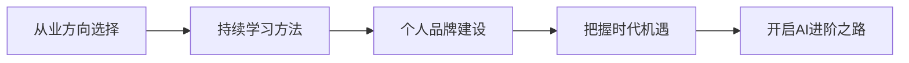

# AI进阶之路

---

## 一、章节概述

### 本章简介

恭喜你完成了AI Navigator的全部进阶路径！

从AI基础入门到产品化开发，从公网部署到规模化运营，你已经掌握了AI应用开发的完整技能栈。但这不是终点，而是新起点。

本章将帮助你：
- 明确未来的发展方向
- 建立持续学习的体系
- 打造个人品牌和影响力
- 把握AI时代的机遇

### 学习目标

完成本章学习后，你将获得：

- **认知目标**: 理解AI时代的发展趋势和职业方向
- **技能目标**: 掌握持续学习和个人品牌建设的方法
- **应用目标**: 制定个人发展计划，明确行动路径

---

## 二、核心内容模块

本章包含四个核心模块，帮助你完成从技能学习到价值创造的转变：

### 模块一：AI从业方向选择

**📄 [查看详情](08_01_AI从业方向选择.md)**

- AI时代的职业版图
  - 技术路线：算法工程师、AI开发者
  - 产品路线：AI产品经理、AI创业者
  - 运营路线：AI运营专家、数据分析师
  - 自由职业：AI顾问、独立开发者
- 如何选择适合自己的方向
  - 兴趣与优势分析
  - 市场机会评估
  - 长期发展潜力
- AI创业的可能性
  - 个人开发者路径
  - 团队创业路径
  - 轻量级MVP验证

> 学完这个模块，你将对AI时代的职业发展有清晰的认识，找到适合自己的方向。

### 模块二：持续学习方法

**📄 [查看详情](08_02_持续学习方法.md)**

- 为什么要持续学习
  - AI技术迭代快
  - 竞争日益激烈
  - 知识半衰期缩短
- 高效学习的方法论
  - 费曼学习法
  - 刻意练习
  - 建立知识体系
- 学习资源推荐
  - 官方文档与教程
  - 优质社区与论坛
  - 实践项目积累
- 如何保持学习动力
  - 设定可实现的目标
  - 建立反馈机制
  - 找到学习伙伴

> 学完这个模块，你将掌握持续学习的方法，保持竞争力。

### 模块三：个人品牌建设

**📄 [查看详情](08_03_个人品牌建设.md)**

- 为什么要打造个人品牌
  - 建立信任背书
  - 获得更多机会
  - 提升个人价值
- 打造个人品牌的步骤
  - 定位清晰的标签
  - 持续输出内容
  - 积累影响力
- 内容创作策略
  - 写作：博客、公众号
  - 视频：B站、抖音
  - 社区：知乎、知识星球
- 影响力的变现
  - 付费社群
  - 咨询顾问
  - 企业培训

> 学完这个模块，你将学会如何打造个人品牌，放大个人价值。

### 模块四：AI时代机遇与行动

**📄 [查看详情](08_04_AI时代机遇与行动.md)**

- AI时代的大趋势
  - 大模型能力爆发
  - AI原生应用崛起
  - 人机协作新范式
- 普通人如何把握机遇
  - AI+本行业
  - AI+兴趣爱好
  - AI+副业创业
- 立即可以行动的事项
  - 打造一个AI应用
  - 建立个人作品集
  - 开始内容输出
- 写在最后
  - 回顾学习路径
  - 展望未来发展
  - 行动号召

> 学完这个模块，你将明确行动方向，立即开始实践。

---

## 三、学习路径建议

### 学习建议

1. **先思考再行动**：认真考虑自己的发展方向
2. **边学边做**：在学习过程中就开始实践
3. **持续输出**：用输出倒逼输入
4. **抱团成长**：找到志同道合的伙伴

---

## 四、总结

完成AI Navigator的全部学习后，你已经具备：

| 能力 | 掌握内容 |
|------|---------|
| AI应用基础 | 会用AI工具提升效率 |
| 自动化能力 | 用RPA和工作流解放双手 |
| AI开发能力 | 开发定制化AI应用 |
| 产品化AI能力封装成产品 |
| 部署能力 | 把产品能力 | 把部署到公网 |
| 运营能力 | 规模化运营产品 |
| 商业能力 | 实现价值变现 |

---

## 附录：AI资源导航

### 学习资源

| 资源类型 | 推荐 |
|---------|------|
| AI工具 | 常用工具指南 |
| 学习社区 | 知乎、CSDN、掘金 |
| 资讯来源 | 36Kr、虎嗅、量子位 |

### 工具资源

| 用途 | 推荐工具 |
|------|---------|
| AI对话 | Claude、ChatGPT |
| AI开发 | Claude Code、Cursor |
| 工作流 | Coze、n8n |
| 部署 | Docker、Vercel |

### 下一站

学无止境，AI时代充满机遇。祝你在这个时代找到自己的位置，创造属于自己的价值！

---

*感谢你完成AI Navigator的全部学习旅程。愿你在AI时代乘风破浪，一往无前！*
